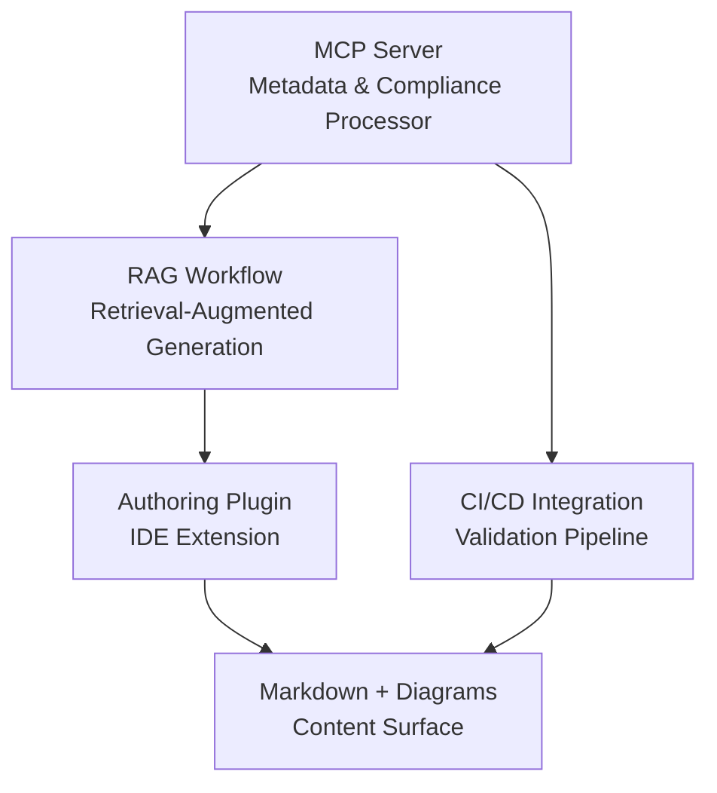
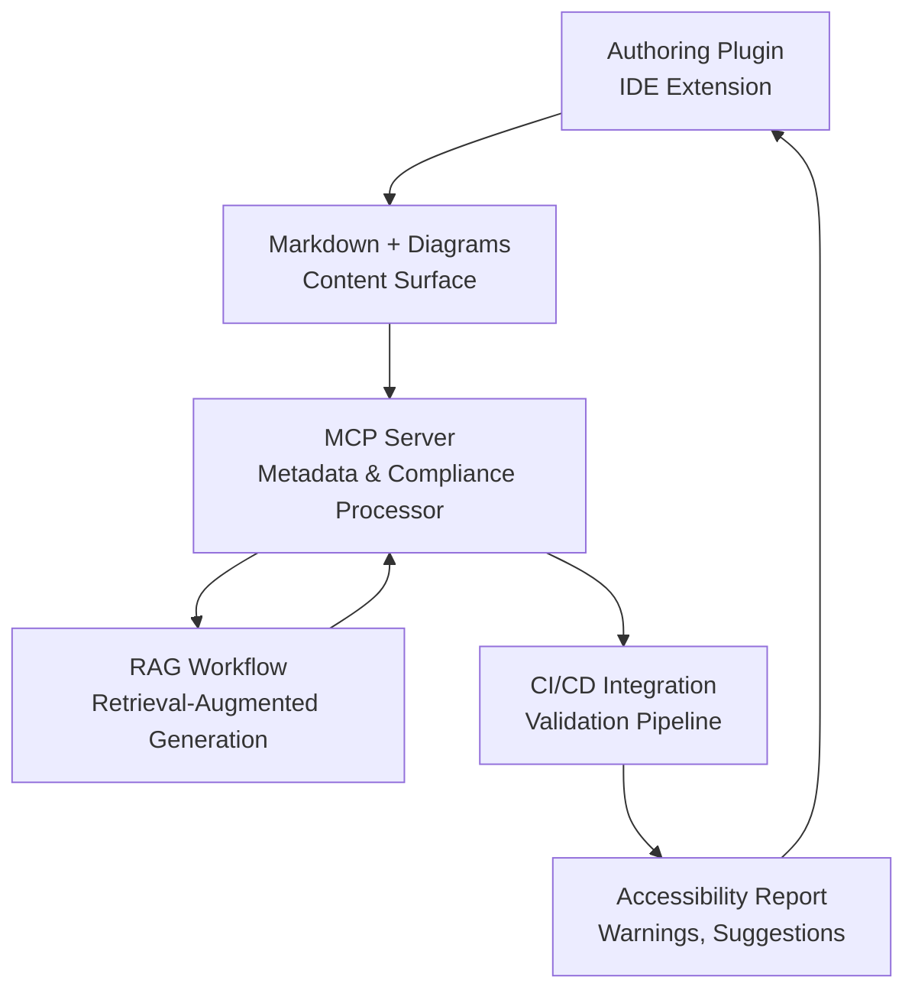

# Accessibility with AI

>A Technical Daydream. While developing this site, it occurred to me that while we’ve made great strides in techcomm automation — reproducibility, modularity, re-use, etc. — we’re still leaving some readers behind. Sightless users, in particular, often encounter diagrams that are visually rich but semantically opaque.

"Our great strides in techcomm automation" thus, while working on this site, started to attract quotation marks: figuring out how to make MkDocs content WCAG-compliant turned out to be more convoluted than expected. The basics are fine, but anything beyond static text (especially diagrams) quickly becomes a mess.

Mermaid won't expose ALT text reliably (or it will and it's just me forgetting to say *please*), SVGs lack accessible markup, and plugins seem allergic to ARIA roles. I spend more time than I’d like chasing down rendering quirks and testing screen reader behavior, just to confirm what isn't working. Every fix introduces a new problem.

So I'm thinking (or daydreaming), what if accessibility wasn’t a bolt-on? What if it were baked into the authoring flow, nudged along by AI that actually understands context — not just checking boxes, but helping us describe what a diagram means, not just what it looks like?

What if our CI/CD pipelines didn’t just validate syntax and links, but flagged missing ALT text with the same urgency as a broken build? What if our authoring tools could suggest meaningful descriptions, catch compliance gaps early, and even learn from our writing style over time?

This page sketches out that daydream. Of a system that's format-agnostic, author-friendly, and built to slot into existing workflows without drama. Whether you’re diagramming infrastructure or documenting edge-case YAML quirks, the goal is the same: make accessibility proactive, reproducible, and just as modular as the rest of your stack.

## The Problem

The problem — to recap briefly — is this: *visual content — diagrams, charts, SVGs, flow states — is often inaccessible to screen readers. Even when authors include `alt` text, it’s usually terse and lacks narrative depth.*

What’s missing is a system that:

- Detects visual content across formats
- Suggests meaningful ALT and DESC metadata
- Integrates into authoring tools and CI
- Learns from context and glossary terms

Next, some sketches of this daydreamed system before I forget even the raw ideas.

## Structure: Who’s Doing What, and Why

Before diving into flows and fallbacks, it helps to map out the cast of characters.

Here is a diagram that lays out the principal or core components of the accessibility infrastructure — authoring tools, metadata processors, AI helpers, and validation pipelines. Each one plays a role in making sure diagrams aren’t just pretty, but also meaningful to every reader.

> It’s not about reinventing the stack, it’s about making sure accessibility has a seat at the table from the start.



## Component Breakdown

### MCP Server (Metadata & Compliance Processor)

- Central engine that parses content, validates accessibility metadata, and coordinates injection
- Handles multiple formats: Markdown, Mermaid, PlantUML, SVG, PNG
- Exposes APIs for plugins and CI tools

### RAG Workflow (Retrieval-Augmented Generation)

- AI model that retrieves glossary terms, headings, and context
- Generates rich ALT and DESC content
- Learns from previous authoring patterns

### Authoring Plugin

- IDE extension (e.g., VS Code, Obsidian, enterprise-class XML authoring tools)
- Provides inline suggestions for ALT/DESC
- Injects metadata and previews screen reader output
- Connects to MCP Server for live feedback

### CI/CD Integration

- GitHub Action or CLI tool
- Validates accessibility metadata during builds
- Flags missing or malformed ALT/DESC
- Acts as a gatekeeper of authoring toolchain-level style guide rules

### Markdown + Diagrams

- The authored content: Markdown files, embedded diagrams, images
- Receives injected metadata from MCP and plugin
- Becomes fully AODA-compliant before deployment

```yaml
jobs:
  accessibility-check:
    runs-on: ubuntu-latest
    steps:
      - name: Run MCP Validator
        run: mcp validate docs/
```

## Authoring Style Guide (Format-Agnostic)


| Format       | Required Metadata                                                            |
| -------------- | ------------------------------------------------------------------------------ |
| Mermaid      | `accTitle: ` and `accDescr` below diagram type declaration, e.g., `graph TD` |
| PlantUML     | Same as Mermaid (TBD)                                                        |
| SVG (inline) | `<title>` + `<desc>` inside `<svg>`                                          |
| PNG/JPEG     | Markdown`` + nearby description                              |
| Canvas/WebGL | External fallback or longform description                                    |

## Data Flow: How Metadata Moves and Evolves

Sometimes metadata is missing, malformed, or just plain confusing. This diagram shows how the system handles those moments gracefully. Whether it’s triggering AI suggestions, prompting manual overrides, or surfacing clear diagnostics in the CI report, the fallback paths are designed to keep things moving without leaving anyone behind.

It’s not failure, it’s feedback. And it’s wired to help, not scold.



**Flow Breakdown**

- Authoring loop: Authoring Plugin ↔ RAG Workflow ↔ Markdown
- Validation loop: Markdown → CI/CD → MCP → Markdown
- Ensures continuous feedback, automated compliance, and AI-assisted authoring

## Handling Errors?

Here is how the system might respond to various metadata issues:


| Scenario           | Trigger                                  | Response                              | Outcome                       |
| -------------------- | ------------------------------------------ | --------------------------------------- | ------------------------------- |
| Missing ALT/DESC   | No metadata in diagram block             | RAG model generates suggestions       | Injected if valid             |
| Invalid metadata   | AI output fails schema or context checks | Author prompted for manual override   | Author-supplied metadata used |
| CI/CD failure      | Metadata present but fails AODA rules    | Report generated with fix suggestions | Author revises content        |
| Unsupported format | Diagram type not recognized              | Skipped or flagged                    | Manual review required        |

## Why It Might be Worth It

Sightless users deserve more than “flowchart of payment states.” They deserve context, relationships, implications. They need to understand the diagram the way a sighted user does.

> Hopefully this system won't be just checking checkboxes — it might empower authors to write accessibly, and help others engage meaningfully (I'm not a developer, neither code, nor real estate; remind me to tell you the joke, "Oh, I'm just the janitor here", lol).

---

2025.08.17
