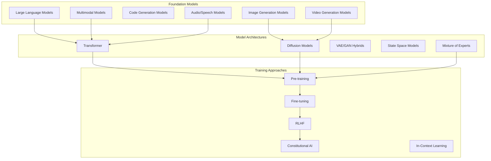
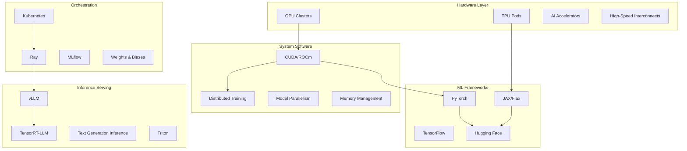
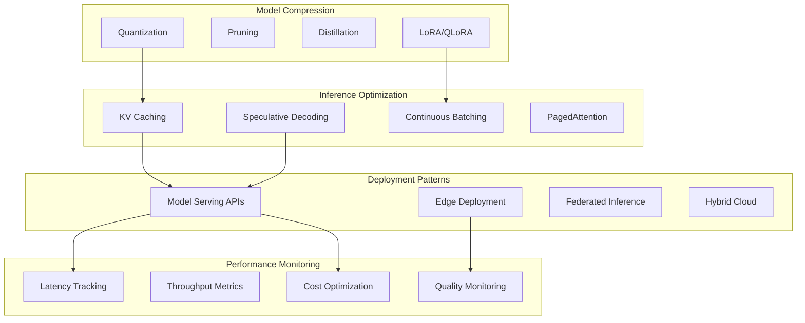

# GenAI Landscape in 2025

>Primer/presentation material.

The Generative Artificial Intelligence (GenAI) landscape has evolved into a complex ecosystem of foundation models, specialized architectures, infrastructure components, and deployment patterns. This primer provides a comprehensive view of the current state, key technologies, and architectural patterns that define the modern GenAI stack.

## Foundation Models Architecture

### Foundation Model Types

**Large Language Models (LLMs)** form the backbone of text-based GenAI. These transformer-based architectures, exemplified by GPT-4, Claude, and Llama, process and generate human language through autoregressive prediction. Key characteristics include parameter counts ranging from billions to trillions, context windows extending from 4K to 2M+ tokens, and emergent capabilities like reasoning and code generation.

**Multimodal Models** integrate multiple input modalities (text, images, audio, video) within unified architectures. GPT-4V, Gemini Ultra, and Claude 3 demonstrate vision-language capabilities, while models like DALL-E 3 and Midjourney specialize in text-to-image generation.

**Diffusion Models** have revolutionized image and video generation through iterative denoising processes. Stable Diffusion, DALL-E, and newer video models like Sora utilize latent diffusion techniques for high-quality content generation.

## Infrastructure and Compute Layer

### Hardware Infrastructure

**GPU Clusters** remain the primary compute substrate, with NVIDIA H100s and A100s dominating training and inference. Memory bandwidth (3TB/s on H100) and tensor cores optimize transformer operations. Google's **TPUs** offer specialized architectures for large-scale training with pod configurations scaling to thousands of chips.

**High-Speed Interconnects** like NVLink, InfiniBand, and custom fabrics enable model parallelism across hundreds of devices. Network topology becomes critical for distributed training efficiency.

### Training Infrastructure Components

**Distributed Training** frameworks like DeepSpeed, FairScale, and PyTorch FSDP enable model training across clusters. Key techniques include:

- **Pipeline Parallelism**: Splitting models across devices by layers
- **Tensor Parallelism**: Distributing individual operations across devices  
- **Data Parallelism**: Replicating models with different data batches
- **ZeRO (Zero Redundancy Optimizer)**: Memory-efficient parameter sharding

**Memory Management** becomes critical with multi-billion parameter models. Techniques include gradient checkpointing, mixed precision training (FP16/BF16), and activation recomputation.

## Model Optimization and Deployment

### Model Compression Techniques

**Quantization** reduces model precision from FP32 to INT8/INT4, achieving 4x-8x memory reduction with minimal quality loss. Post-training quantization (PTQ) and quantization-aware training (QAT) represent primary approaches.

**Low-Rank Adaptation (LoRA)** and **Quantized LoRA (QLoRA)** enable parameter-efficient fine-tuning by learning low-rank updates to frozen base models. This reduces trainable parameters by 99%+ while maintaining performance.

**Knowledge Distillation** transfers capabilities from large "teacher" models to smaller "student" models, enabling deployment in resource-constrained environments.

### Inference Optimization

**KV Caching** stores key-value pairs from previous tokens to avoid recomputation during autoregressive generation. **PagedAttention** (used in vLLM) manages KV cache memory efficiently through virtual memory techniques.

**Speculative Decoding** uses smaller draft models to propose multiple tokens, with the larger model verifying and accepting valid sequences, improving generation speed.

**Continuous Batching** allows dynamic batching of requests with different sequence lengths, maximizing GPU utilization compared to static batching.

## Application Architecture Patterns

```mermaid
flowchart TB
  subgraph RAG["Retrieval Augmented Generation"]
    VDB["Vector Databases"]
    EMB["Embedding Models"]
    RET["Retrieval Pipeline"]
    FUSION["Context Fusion"]
  end

  subgraph Agents["Agent Frameworks"]
    PLAN["Planning"]
    TOOLS["Tool Use"]
    MEMSYS["Memory Systems"]
    MAC["Multi-Agent Coordination"]
  end

  subgraph Fine_Tuning["Fine-tuning Pipelines"]
    DATA["Dataset Preparation"]
    TRAIN["Training Infrastructure"]
    EVAL["Evaluation Frameworks"]
    REG["Model Registry"]
  end

  subgraph Production["Production Systems"]
    GATE["API Gateways"]
    LB["Load Balancing"]
    CACHE["Caching Layers"]
    MON["Monitoring/Logging"]
  end

  EMB --> VDB
  VDB --> RET
  RET --> FUSION
  PLAN --> TOOLS
  TOOLS --> MEMSYS
  DATA --> TRAIN
  TRAIN --> EVAL
  EVAL --> REG
  GATE --> LB
  LB --> CACHE
```

### Retrieval-Augmented Generation (RAG)

RAG architectures address knowledge limitations by incorporating external information retrieval. Key components include:

**Vector Databases** (Pinecone, Weaviate, Chroma) store document embeddings for semantic search. **Embedding Models** (text-embedding-ada-002, sentence-transformers) convert text to dense vectors for similarity matching.

**Hybrid Search** combines semantic similarity with keyword matching (BM25) for improved retrieval accuracy. **Reranking** models refine initial retrieval results.

### Agentic Systems

**AI Agents** represent autonomous systems that plan, execute, and reflect on multi-step tasks. Core capabilities include:

- **Tool Use**: Integration with external APIs, databases, and computational systems
- **Planning**: Decomposing complex tasks into executable steps
- **Memory**: Maintaining context across extended interactions
- **Reflection**: Self-evaluation and error correction

Frameworks like LangChain, CrewAI, and AutoGen enable multi-agent coordination for complex workflows.

## Evaluation and Safety

```mermaid
flowchart TB
  subgraph Capability_Eval["Capability Evaluation"]
    BENCH["Benchmarks"]
    HUMAN["Human Evaluation"]
    AUTO["Automated Scoring"]
    DOMAIN["Domain-Specific Tests"]
  end

  subgraph Safety_Measures["Safety Measures"]
    ALIGN["Alignment Training"]
    CONST["Constitutional AI"]
    RED["Red Teaming"]
    INTERP["Interpretability"]
  end

  subgraph Monitoring["Monitoring Systems"]
    DRIFT["Drift Detection"]
    BIAS["Bias Monitoring"]
    PERF["Performance Tracking"]
    GUARD["Safety Guardrails"]
  end

  subgraph Governance["Governance"]
    CARDS["Model Cards"]
    AUDIT["Audit Trails"]
    COMP["Compliance Tracking"]
    RISK["Risk Assessment"]
  end

  BENCH --> AUTO
  HUMAN --> DOMAIN
  ALIGN --> CONST
  CONST --> RED
  DRIFT --> BIAS
  BIAS --> GUARD
  CARDS --> AUDIT
  AUDIT --> RISK
```

### Evaluation Frameworks

**Capability Benchmarks** include MMLU (massive multitask language understanding), HumanEval (code generation), and HellaSwag (commonsense reasoning). **Domain-specific evaluations** assess performance in specialized areas like medicine (MedQA), law (LegalBench), and mathematics (MATH).

**Human Evaluation** remains critical for assessing subjective qualities like helpfulness, harmlessness, and honesty. Platforms like Scale AI and Surge AI provide human feedback infrastructure.

### Safety and Alignment

**Constitutional AI** trains models to follow a set of principles through self-critique and revision. **RLHF (Reinforcement Learning from Human Feedback)** optimizes model outputs based on human preferences.

**Red Teaming** involves adversarial testing to identify harmful outputs, bias, or capability limitations. **Interpretability** research aims to understand model decision-making through techniques like activation patching and mechanistic interpretability.

## Economic and Scaling Dynamics

Training costs for frontier models now exceed $100M, with GPT-4 estimated at $200M+ and emerging models potentially reaching $1B+. **Scaling Laws** (Kaplan, Chinchilla) predict performance improvements with increased compute, data, and parameters.

**Inference Economics** drive deployment decisions. Cost per token ranges from $0.0001 (GPT-3.5) to $0.06 (GPT-4) for API services. Self-hosted deployments offer cost advantages at scale but require significant infrastructure investment.

**Compute Trends** suggest training requirements growing 10x annually, straining available GPU capacity and driving innovations in efficiency and alternative architectures.

## Emerging Trends and Future Directions

**Multimodal Integration** continues expanding beyond text-image to include audio, video, and sensor data. **Reasoning Models** like OpenAI's o1 demonstrate improved capability on complex logical and mathematical tasks through iterative refinement.

**Mixture of Experts** architectures enable larger model capacity with constant inference cost. **State Space Models** (Mamba) offer alternatives to transformer attention mechanisms with better scaling properties.

**Edge AI** deployment brings GenAI capabilities to mobile and IoT devices through model compression and specialized hardware. **Federated Learning** enables distributed training while preserving data privacy.

The GenAI landscape continues rapid evolution, with new architectures, optimization techniques, and application patterns emerging regularly. Success requires understanding both current capabilities and underlying technological trends driving future development.

2025.09.19
