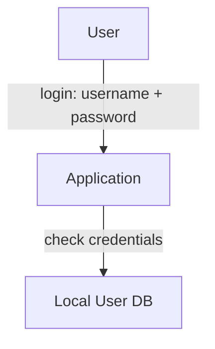
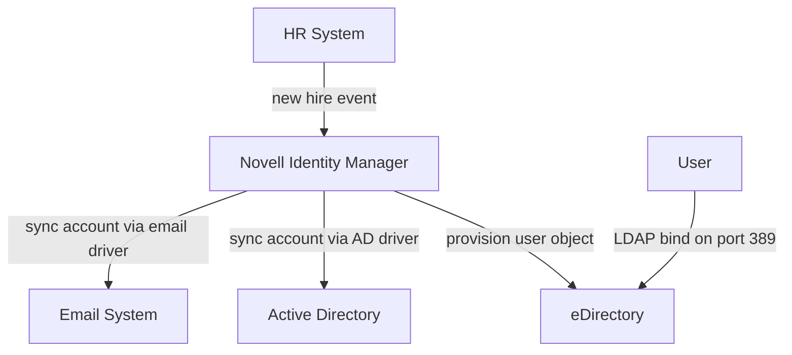
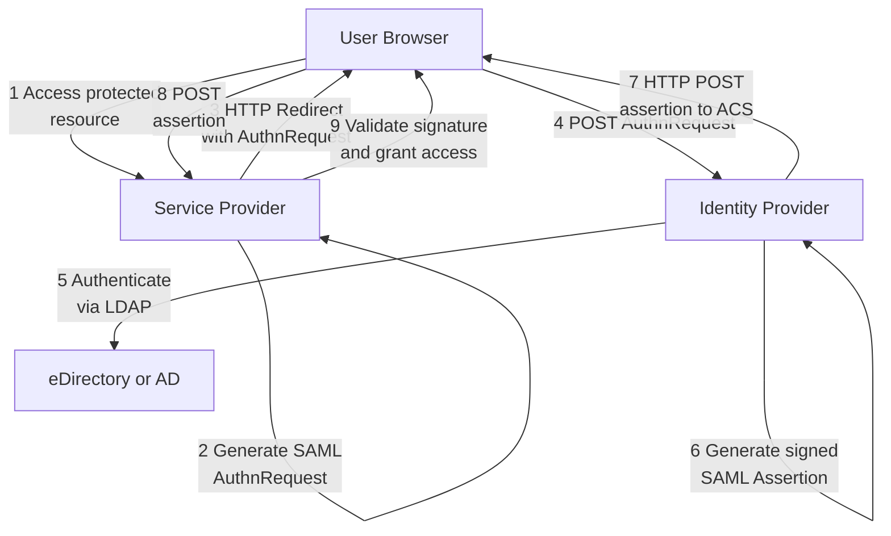
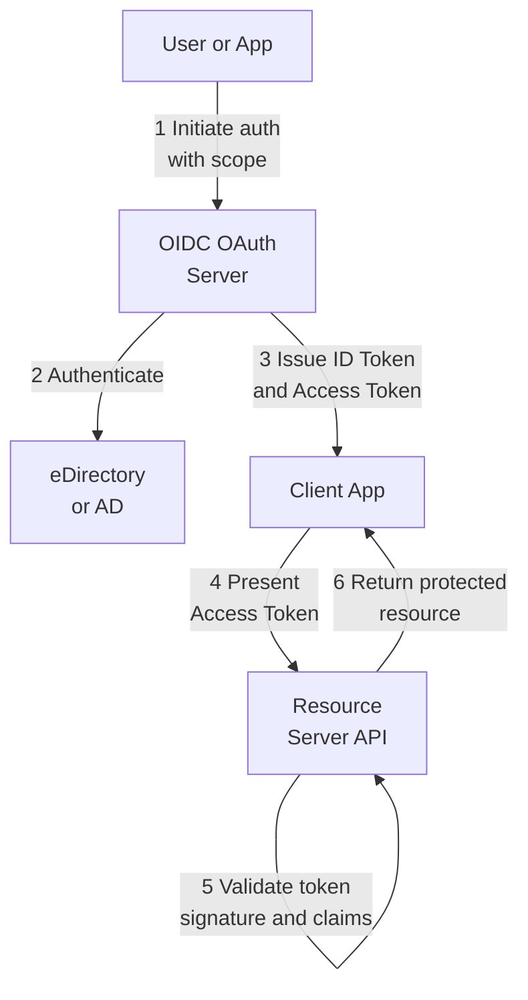
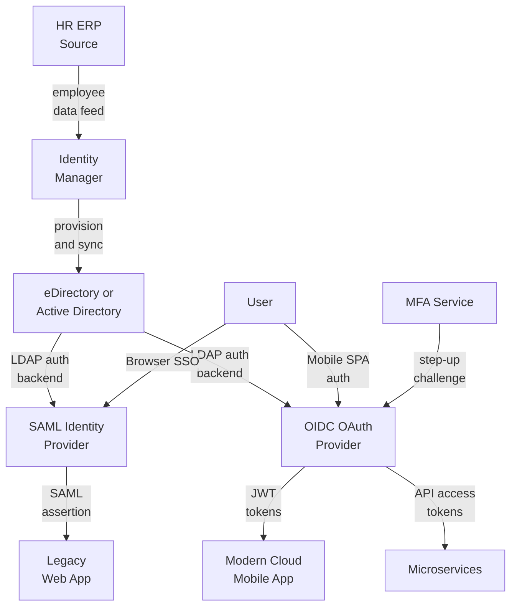

# The Long Arc of Digital Identity: From Islands to Federation

## Introduction

In the 1990s, every application was its own island. A user's "identity" was whatever record lived in that app's local database. As organizations grew, this model collapsed under its own weight — employees juggled dozens of credentials, IT departments drowned in password resets, and security became a game of whack-a-mole across disconnected systems.

What followed was a 30-year evolution from **isolated authentication** toward **federated trust** — a journey that fundamentally changed how we think about identity in computing.

This essay traces that evolution through four distinct eras, examining not just what changed, but *why* these shifts happened and what trade-offs each generation accepted. Understanding this progression helps explain the hybrid architectures most enterprises run today, where all four models often coexist in an uneasy alliance.

## Era 1: Local Authentication (1990s)

Each application stored and verified credentials locally. Identity existed nowhere except inside that application's database.

### How It Worked

Applications performed simple string comparison or basic hashing against stored passwords:

- Passwords stored in plain text or weakly hashed (MD5, SHA-1)
- No salting, no key derivation functions
- Session management via simple cookies with minimal expiration
- Each app reimplemented authentication logic from scratch

The flow of the rudimentory local authentication:



### Why It Failed

- **The password problem:** Users reused weak passwords across systems. A breach in one application meant credentials for all applications.
- **The operational nightmare:** Onboarding a new employee meant manually creating accounts in 15+ systems. Off-boarding meant remembering to delete from all of them (spoiler: you forgot at least three).
- **No visibility:** Security teams had no way to detect compromised accounts or enforce policies across systems. Audit trails existed in siloes, making forensics nearly impossible.
- **The breaking point:** As web applications proliferated in the late 1990s, organizations realized they needed a fundamental rethink. You can't scale islands.

## Era 2: Centralized Identity Management (Early 2000s)

Identity became a **shared organizational resource**, managed centrally in directories (LDAP, eDirectory, Active Directory) and synchronized everywhere by meta-directory tools.

### How It Worked

- **Directory Services:** LDAP (Lightweight Directory Access Protocol, RFC 4511) became the standard. Applications no longer stored credentials — they performed **bind operations** against a directory server on port 389 (636 for LDAPS).
- **Meta-Directory Engines:** Tools like Novell Identity Manager, Microsoft Identity Integration Server, and Sun Identity Manager used **drivers** to synchronize identity data:
- **Publisher/Subscriber channels:** Changes flowed bidirectionally through a policy engine
- **Connectors:** Java or ECMA-based adapters for each target system (AD, SAP, mainframes)
- **Policy-based provisioning:** "If user.department = 'Engineering', create account in these systems with these attributes"
- **Conflict resolution:** When multiple systems updated the same attribute, engines used timestamp-based or priority-based logic
**Password Synchronization:** Some deployments used password filters (DLLs hooked into domain controllers) to intercept password changes and propagate them in real-time.

Here is a diagram showing the centralized identity management and directory synchronization flow:



### The Value Proposition

- **Single source of truth:** HR system becomes authoritative; identity flows downstream automatically
- **Automated lifecycle:** Hire-to-retire workflows replaced manual provisioning
- **Centralized policy enforcement:** Password complexity, account expiration, role-based access
- **Audit trail:** Who provisioned what, when, and why

### The Limitations

- **Still fundamentally internal:** This model worked beautifully within an enterprise but offered no path to federate with partners, cloud services, or external applications.
- **Password synchronization is fragile:** Keeping passwords in sync across systems created timing windows and failure modes. A better model would eliminate password synchronization entirely.
- **The cloud changes everything:** By the late 2000s, SaaS applications appeared. Your internal directory couldn't provision accounts in Salesforce or Google Apps — at least not without complex connectors that broke constantly.

## Era 3: Web Federation via SAML (Mid-2000s to 2010s)

Instead of every application storing credentials, applications learned to **trust** an Identity Provider (IdP) to authenticate users and issue cryptographically signed **assertions**.

### How It Worked

**SAML 2.0 (Security Assertion Markup Language)** introduced browser-based Single Sign-On:

1. User accesses a Service Provider (SP) application
2. SP generates an `AuthnRequest` and redirects the browser to the IdP
3. IdP authenticates the user (typically against LDAP/AD)
4. IdP generates a signed XML assertion containing user attributes
5. Browser POSTs the assertion back to the SP's Assertion Consumer Service (ACS)
6. SP validates the XML signature and grants access

**The SAML Assertion:**
```xml
<saml:Assertion>
  <saml:Subject>
    <saml:NameID>user@example.com</saml:NameID>
  </saml:Subject>
  <saml:Conditions NotBefore="..." NotOnOrAfter="...">
    <saml:AudienceRestriction>
      <saml:Audience>https://sp.example.com</saml:Audience>
    </saml:AudienceRestriction>
  </saml:Conditions>
  <saml:AttributeStatement>
    <saml:Attribute Name="email">
      <saml:AttributeValue>user@example.com</saml:AttributeValue>
    </saml:Attribute>
    <saml:Attribute Name="department">
      <saml:AttributeValue>Engineering</saml:AttributeValue>
    </saml:Attribute>
  </saml:AttributeStatement>
  <ds:Signature>...</ds:Signature>
</saml:Assertion>
```

- **Trust Establishment:** SP and IdP exchanged metadata XML files containing X.509 certificates (RSA-2048+) and endpoint URLs. The SP validated assertions using the IdP's public key — no shared secrets required.
- **Session Management:** The `NotOnOrAfter` condition plus SP-side session cookies controlled SSO duration.

Here is the single sign-on flow:



### Why This Mattered

- **The cloud breakthrough:** SAML enabled enterprises to federate with external SaaS providers. Employees could access Salesforce, Workday, and internal apps with one login.
- **Cryptographic trust:** XML signatures meant SPs didn't need to call back to the IdP to validate assertions — they could verify them locally using public-key cryptography.
- **Attribute propagation:** Assertions carried user attributes (email, role, department), enabling attribute-based access control without provisioning accounts in advance.
- **Cross-organizational federation:** Universities formed federations (InCommon, eduGAIN) where students could access resources at any member institution.

### The Limitations

- **Web-only:** SAML assumed browser redirects. Native mobile apps and API-to-API communication didn't fit the model.
- **XML complexity:** SAML's XML signatures and canonicalization rules were notoriously difficult to implement correctly. Many implementations had security vulnerabilities.
- **Single Logout is a nightmare:** SAML Single Logout (SLO) attempted to terminate sessions at IdP and all SPs simultaneously — but relied on browser redirects and cooperation from all parties. In practice, it rarely worked reliably.
- **The mobile revolution:** By 2010, smartphones demanded a better model. SAML wasn't designed for native apps that couldn't intercept HTTP redirects.

## Era 4: Token-Based Federation (2010s–Present)

**OAuth 2.0** and **OpenID Connect (OIDC)** introduced token-based delegation for web, mobile, and API ecosystems. Identity became an API service.

### How It Worked

**OAuth 2.0** is an authorization framework that enables applications to obtain limited access to user resources without exposing credentials. It introduced **scopes** (permissions) and multiple **flows** for different scenarios:

- **Authorization Code Flow (with PKCE):** Most secure, for web and mobile apps
- **Client Credentials Flow:** Service-to-service authentication without user context
- **Implicit Flow:** Deprecated due to security concerns

**OpenID Connect** added an authentication layer on top of OAuth 2.0, introducing the **ID Token** — a JSON Web Token (JWT) that contains user identity claims.

**JWT Structure:**
```json
{
  "header": {"alg": "RS256", "typ": "JWT", "kid": "abc123"},
  "payload": {
    "iss": "https://idp.example.com",
    "sub": "user-id-12345",
    "aud": "client-app-xyz",
    "exp": 1735689600,
    "iat": 1735686000,
    "email": "user@example.com",
    "email_verified": true,
    "nonce": "random-nonce"
  },
  "signature": "..."
}
```

Tokens are signed using RSA or ECDSA. Resource servers validate them by:
1. Fetching the IdP's public keys from `/.well-known/jwks.json`
2. Verifying the signature
3. Checking `iss` (issuer), `aud` (audience), `exp` (expiration), `nonce` (replay protection)

**Access Tokens vs Refresh Tokens:**
- **Access tokens:** Short-lived (5-15 minutes), presented to APIs to access resources
- **Refresh tokens:** Long-lived (days/months), used to obtain new access tokens without re-authentication
- **PKCE (Proof Key for Code Exchange, RFC 7636):** Prevents authorization code interception attacks in mobile and single-page applications by introducing a cryptographic challenge.

The OAuth 2.0 and OIDC token-based authentication flow, diagrammatically:



### Why This Won

- **Device-agnostic:** Works seamlessly across web browsers, native mobile apps, single-page apps, and backend services.
- **API-first:** Access tokens are designed for REST APIs and microservices architectures.
- **Fine-grained authorization:** Scopes enable precise control over what an application can do (e.g., `calendar:read`, `email:send`).
- **Delegated access:** Users can grant third-party apps limited access to their data without sharing passwords (the "Sign in with Google" use case).
- **JSON simplicity:** Compared to SAML's XML, JWT's JSON structure is easier to parse and debug.
- **Token introspection:** Resource servers can query the IdP to validate opaque tokens via RFC 7662.

### The Trade-Offs

- **Token sprawl:** Managing access tokens, refresh tokens, ID tokens, and their lifecycles adds complexity.
- **Security maturity required:** Short-lived tokens, token rotation, secure storage, and proper validation are essential — but easy to get wrong.
- **The "just use a library" problem:** OAuth/OIDC are flexible frameworks, not prescriptive protocols. Developers must make many security-critical decisions, leading to inconsistent implementations.

## Comparative Analysis

| Era | Identity Source | Protocol | Scope | Trust Model | Key Innovation | Primary Limitation |
|-----|-----------------|----------|-------|-------------|----------------|-------------------|
| **1990s Local Auth** | Local DB per app | Username/Password | Single application | Shared secrets | N/A (baseline) | Fragmented identities, password reuse |
| **2000s Directory/IDM** | Central directory (LDAP/AD) | LDAP bind + Sync | Enterprise-wide | Centralized credentials | Automated provisioning | No cross-domain federation |
| **2000s–2010s SAML** | Directory-backed IdP | XML assertions | Web SSO (internal + external) | Public-key cryptography (XML signatures) | Cross-organizational federation | Web-only, XML complexity |
| **2010s–Present OAuth/OIDC** | Cloud IdP or directory | JSON tokens (JWT) | Web + Mobile + API | Token-based (short-lived, signed JWTs) | Device-agnostic, API-ready | Token lifecycle complexity |

### The Common Thread

Each transition addressed a specific breaking point:
- **Local → Directory:** Password sprawl and operational burden
- **Directory → SAML:** Need for external federation and cloud SSO
- **SAML → OAuth/OIDC:** Mobile devices and API-driven architectures

Each generation *abstracted identity one layer further* from individual applications, moving toward identity as a platform service.

## How They Coexist Today

Modern enterprises rarely run a single model — they operate hybrid architectures where all four layers coexist:



The diagram above shows a typical enterprise stack:

1. **HR system** feeds identity data into an **Identity Manager** (IDM)
2. **IDM** provisions and synchronizes accounts to **Active Directory** and **eDirectory**
3. **Directories** serve as the authentication backend for both SAML and OIDC providers
4. **SAML IdP** handles SSO for legacy web applications (SharePoint, on-premise portals)
5. **OIDC Provider** issues JWTs for modern cloud apps, mobile clients, and microservices
6. **MFA service** provides step-up authentication for high-risk operations

### Additional Modern Layers

- **Conditional Access / Context-Aware Authentication:** IdPs evaluate device posture, location, IP reputation, and risk scores before issuing tokens. A login from a corporate laptop on the office network might succeed automatically, while the same user from a cafe triggers MFA.
- **Multi-Factor Authentication (MFA):** Time-based OTP (TOTP, RFC 6238), push notifications, SMS codes, and **WebAuthn/FIDO2** for passwordless authentication using biometrics or hardware keys.
- **Zero Trust Architecture:** Continuous verification replaces "trust but verify." Access tokens expire quickly (5-15 minutes), refresh tokens are rotated, and every request is evaluated against policy.

**Evolving Standards:**
- **OAuth 2.1:** Consolidates best practices, mandates PKCE, removes insecure flows
- **FAPI (Financial-grade API):** High-security profile for sensitive sectors (banking, healthcare)

### Common Migration Patterns

**SAML → OIDC Migration:**
1. Stand up OIDC provider alongside existing SAML IdP (both backed by same directory)
2. Migrate new applications to OIDC
3. Gradually move legacy apps as vendors add OIDC support
4. Maintain SAML IdP for stragglers (some vendors will never update)

**The hybrid reality:** Most enterprises will run SAML and OIDC side-by-side for years, possibly indefinitely.


## Why This History Matters

Understanding these layers isn't just academic — it explains *why* your authentication infrastructure looks the way it does:

- **Why do we still have Active Directory?** Because Era 2 (directories) became load-bearing infrastructure. Thousands of applications authenticate against LDAP, and ripping that out would break everything.
- **Why does SSO feel inconsistent?** Because some apps use SAML, some use OIDC, some still require local passwords, and they don't always play nicely together.
- **Why are tokens so complicated?** Because OAuth 2.0 chose flexibility over prescription, allowing for many valid (and many insecure) implementations.
- **Why can't we just start over?** Because backward compatibility matters. The 20-year-old app running your supply chain won't magically support OIDC. You build *around* it.

### For Decision-Makers

- **New applications:** Default to OIDC. It's the modern standard.
- **Existing SAML apps:** Keep them on SAML unless there's a compelling reason to migrate.
- **Legacy apps without federation:** Consider a reverse proxy with authentication injection (e.g., OAuth2 Proxy, Authelia) rather than modifying the app.
- **Partner federation:** SAML still dominates B2B use cases (especially government and higher education).

### For Developers

- **Use battle-tested libraries:** Don't implement OAuth/OIDC flows from scratch. Use Auth0, Keycloak, Okta SDKs, or proven open-source libraries.
- **Short-lived tokens are your friend:** Prefer 5-15 minute access tokens with refresh token rotation over long-lived tokens.
- **Validate everything:** Check token signatures, expiration, audience, issuer. One missed validation = security vulnerability.
- **Test federation edge cases:** What happens when the IdP is down? When tokens expire mid-session? When a user's account is disabled but they have a valid refresh token?

## The Next Frontier

The identity journey continues. Emerging trends include:

- **Decentralized Identity (DIDs, Verifiable Credentials):** Users control their own identity data via blockchain or distributed ledgers, presenting cryptographically signed credentials without central IdPs. Still experimental, but gaining traction in government ID and academic credentials.
- **Privacy-Preserving Authentication:** Zero-knowledge proofs enable authentication without revealing identifying information — you prove you're over 21 without disclosing your birthdate.
- **Post-Quantum Cryptography:** Current RSA/ECDSA signatures in SAML and JWT will be vulnerable to quantum computers. NIST's post-quantum algorithm standards (2024) are beginning to influence long-term identity architectures.
- **Passwordless by Default:** WebAuthn/FIDO2 adoption is accelerating. Biometrics and hardware keys are replacing passwords entirely, not just augmenting them with MFA.

## Wrap-up

From local databases to federated APIs, identity infrastructure evolved to solve real problems: password fatigue, operational overhead, cloud integration, mobile support. Each era built on its predecessors rather than replacing them — which is why modern enterprises run archaeological layers of authentication, all simultaneously.

The login button you click today is the visible tip of a 30-year accumulation of protocols, compromises, and architectural decisions. Understanding that history helps you navigate the hybrid mess we've inherited—and design better systems for the future.

Identity infrastructure is never "done." It's a living system that adapts to new threats, new devices, and new organizational needs. The next chapter is already being written.

2025.10.05