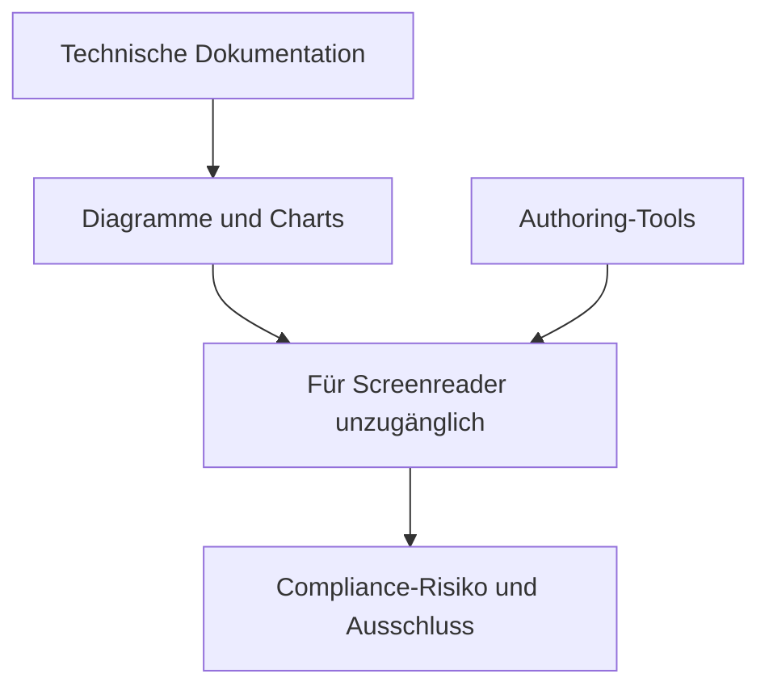
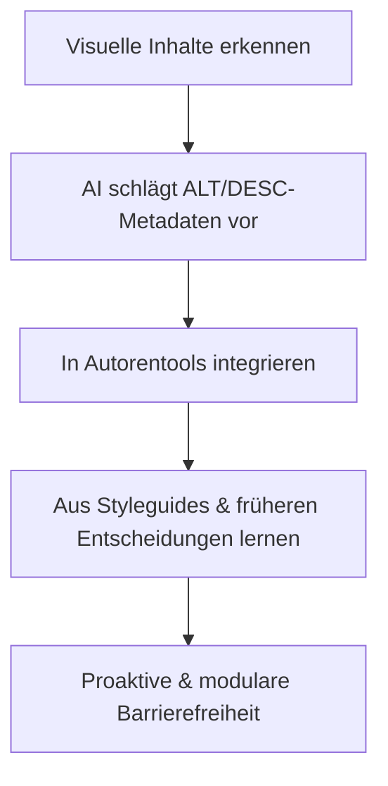
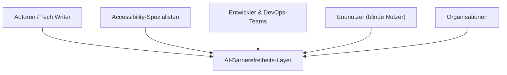
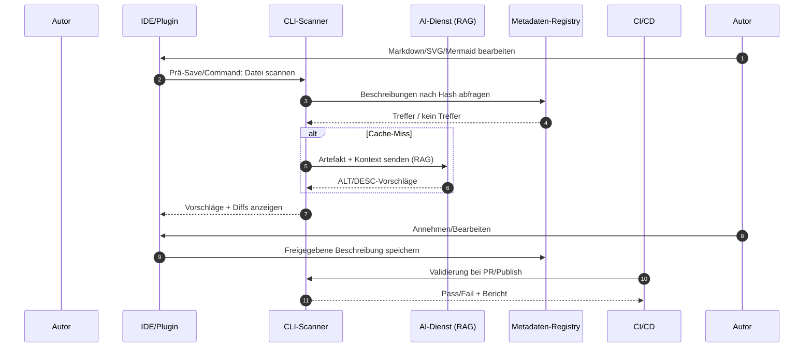
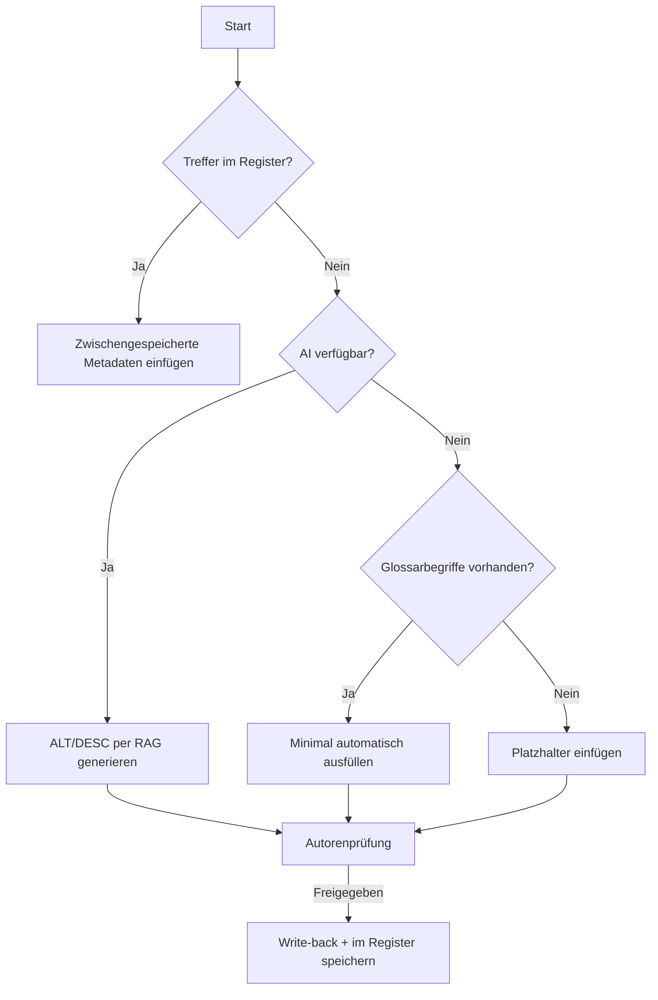
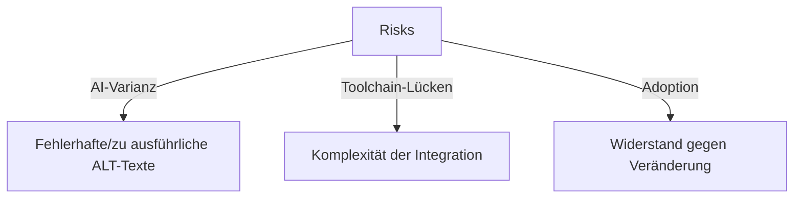
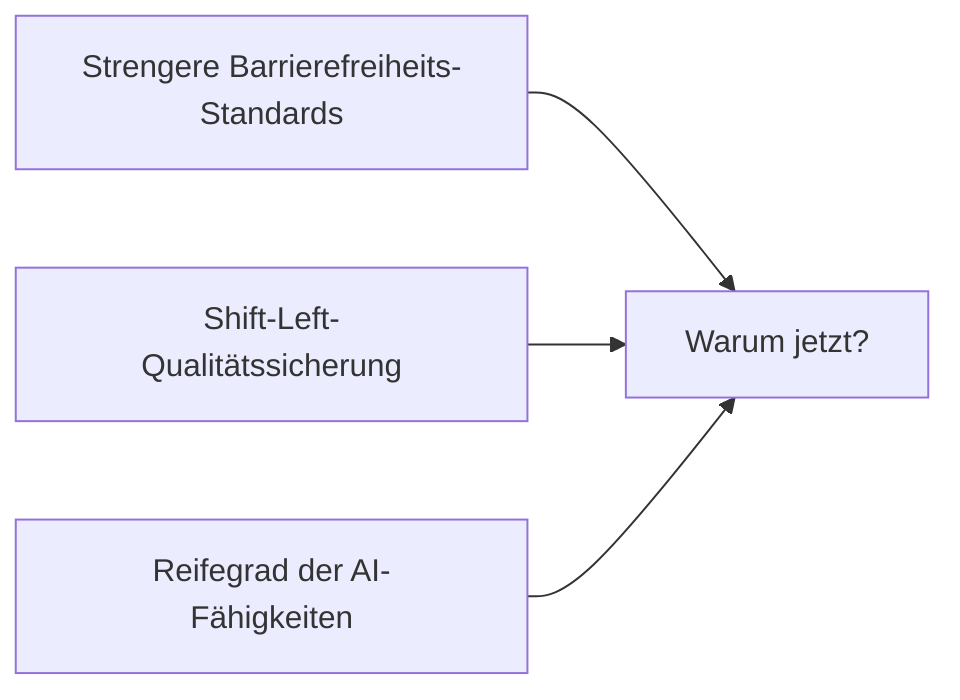

# Barrierefreiheit mit KI (Konzeptpapier)

## 1. Problemstellung

Die moderne technische Dokumentation setzt auf **Automatisierung und Modularität** (z.B. wiederverwendbares Markdown, generierte Diagramme, CI/CD-Publizierung). Doch die Barrierefreiheit hat damit nicht Schritt gehalten:

* **Visuelle Inhalte** - Diagramme, Flussdiagramme, SVGs, Tabellen - sind für Screenreader (Vorleseprogramme) weitgehend unzugänglich.
* Selbst wenn ALT-Text vorhanden ist, ist er oft **minimal ("Flussdiagramm der Zustände")** und hat nicht die **inhaltliche Aussagekraft**, die für ein tiefgehendes Verständnis erforderlich ist.
* Aktuelle Dokumentationswerkzeuge (MkDocs, Mermaid, PlantUML usw.) bieten nur begrenzte oder mangelhafte Unterstützung für barrierefreie Metadaten.
* Autoren stehen vor **hohen Hürden**: Umgehungslösungen, uneinheitliche ARIA-Unterstützung und ein hoher Testaufwand.
* Mit zunehmender Größe der Dokumentation steigt auch das **Risiko unzugänglicher Inhalte**. Dies birgt für Organisationen das Risiko von Compliance-Lücken (WCAG, AODA) und untergräbt die Inklusivität.

Barrierefreiheit ist heute oft eine **nachträglich eingeführte** Lösung und nicht eine **integraler Bestandteil** der Praxis.



---

## 2. Vorgeschlagene Lösung

Einführung einer **KI-erweiterten Zugänglichkeitsschicht**, die:

* **Erkennung** visueller Inhalte in verschiedenen Formaten (Mermaid, PlantUML, SVG, PNG, Canvas).
* **Schlägt** aussagekräftige ALT- und DESC-Metadaten vor und nutzt RAG (retrieval-augmented generation), indem es lokale Glossare/Kontexte nutzt.
* **Integration** in Autorentools (IDE-Plugins, XML-Editoren, CCMS-Plattformen).
* **Lernt** aus organisatorischen Stilrichtlinien und früheren Autorenentscheidungen.

Dadurch wird sichergestellt, dass die Zugänglichkeit **proaktiv, reproduzierbar und modular** ist - genau wie andere Teile des Dokumentations-Stacks.



---

## 3. Mehrwert

**Für Autoren:**

* Spart Zeit durch automatische Erstellung von Metadaten.
* Bietet Inline-Feedback und Konformitätsprüfungen während der Erstellung.
* Reduziert die kognitive Belastung durch das Merken von Zugänglichkeitsregeln.

**Für Leser (vor allem sehbehinderte Benutzer):**

* Liefert aussagekräftige, kontextbezogene Beschreibungen von Diagrammen.
* Verbessert das Benutzerbindung und das Verständnis über die bloße Compliance hinaus.

**Für Organisationen:**

* Reduziert das Risiko der Nichteinhaltung gesetzlicher Vorschriften (ADA/AODA, WCAG 2.2).
* Ermöglicht die Skalierung der Zugänglichkeit konsistent über große Dokumentenbestände hinweg.
* Verbessert die Inklusivität und den Ruf der Marke.



---

## 4. Implementierungsfahrplan (inkrementeller Ansatz)

**Phase 1 - MVP**

* CLI-Tool scannt Markdown/Diagramme nach fehlendem ALT-Text.
* Optionale Vorschläge durch die KI-API.

**Phase 2 - Autoren-Plugin**

* IDE/CCMS-Integration.
* Inline-Vorschläge und Vorschau.
* Glossargenerierung durch den MCP-Server.

**Phase 3 - CI/CD-Integration**

* GitHub Action oder CLI-Validator.
* Kennzeichnung von Zugänglichkeitsfehlern während des Build-Prozesses.

**Phase 4 - Metadaten und Compliance Server**

* Zentralisierte Durchsetzung von Regeln.
* RAG-gestütztes Glossar und Kontext.
* API für organisationsweite Einführung.

| Phase | Merkmal | Wochen ab Start |
| --------- | -------------------------------------------- | :----------: |
| Phase 1 | MVP: CLI-Scanner + KI-Vorschläge | 4 |
| Phase 2 | Authoring Plugin: IDE/CCMS-Integration | 10 |
| Phase 3 | CICD-Integration: Build-Validierung | 14 |
| Phase 4 | Compliance Server: Zentralisierte Regeln + API | 18 |

---

## 4b. Arbeitsablauf zur Metadaten-Einfügung (Technischer Überblick)

Barrierefreie Metadaten werden bei der **Erzeugung** oder **Veröffentlichung** eingefügt.



### 1) Erkennung

* **Parser**: Markdown-, HTML- und SVG-Parser (z. B. remark/rehype oder benutzerdefinierter AST)  Elemente wie: ``, `<svg>`, Mermaid/PlantUML-Blöcke, `<canvas>` Schnappschüsse.
* **Heuristik**: Fehlender oder unzureichender `Alt-Text` (z.B. entspricht `/^(image|diagram|chart)/i`).
* **Kontexterfassung**: Umschließende Überschriften/Absätze + Dateipfad werden als Eingabe für RAG verwendet.

**Beispiel: Minimaler Python-CLI-Detektor**

```python
# detect.py
import re, sys, json, hashlib, pathlib

IMG_MD = re.compile(r"!\[(?P<alt>[^\]]*)\]\((?P<src>[^\s\)]+)(?:\s+\"(?P<title>[^\"]*)\")?\)")

LOW_ALT = re.compile(r"^(?:|image|diagram|chart|graph|figure)\b", re.I)


def hash_file(path):
    p = pathlib.Path(path)
    if not p.exists():
        return None
    h = hashlib.sha256()
    h.update(p.read_bytes())
    return h.hexdigest()


def scan_markdown(md_text, base_dir="."):
    findings = []
    for m in IMG_MD.finditer(md_text):
        alt, src = m.group("alt"), m.group("src")
        needs = (not alt) or LOW_ALT.match(alt or "")
        if needs:
            findings.append({
                "kind": "img_md",
                "span": m.span(),
                "src": src,
                "hash": hash_file(pathlib.Path(base_dir) / src)
            })
    return findings

if __name__ == "__main__":
    text = sys.stdin.read()
    print(json.dumps(scan_markdown(text), indent=2))
```

### 2) Vorschlag (AI + RAG) &amp; Überprüfung durch den Autor

* **Inputs**: Artefakt (SVG-Quelle oder PNG), lokaler Kontext (Überschrift, vorangehender Absatz), Glossareinträge.
* **Ausgaben**: kurzer `Alt` (&lt;= 125 Zeichen), längerer `Desc`/`Longdesc` (1-5 Sätze), optionale `Datenrollen`.
* **Man-in-the-Loop**: (Mensch im Regelkreis) IDE-Fenster zeigt Kandidaten mit Schnellannahme und Bearbeitung an.

**Pseudo-API-Aufruf**

```python
# suggest.py (pseudo)
from typing import Dict

def suggest_alt_desc(artifact_bytes: bytes, mime: str, context: Dict) -> Dict:
    payload = {
        "artifact": artifact_bytes.decode("utf-8", errors="ignore") if mime=="image/svg+xml" else None,
        "mime": mime,
        "context": context,  # {heading, paragraph, glossary_terms}
        "targets": {"alt": True, "desc": True}
    }
    # POST to AI endpoint; handle timeouts & retries
    # response = http.post(...)
    response = {
        "alt": "State machine for order lifecycle (new → paid → shipped → delivered).",
        "desc": "Flow begins at 'new', transitions to 'paid' after payment, then 'shipped', and ends at 'delivered'. Includes cancel path from 'new' and 'paid'."
    }
    return response
```

### 3) Einfügung (Write-Back)

* **SVG**: sicherstellen, dass `<title>` und `<desc>` Untergeordnete-Elemente existieren; ersetzen oder anhängen.
* **Markdown**: Umschreiben der Bildreferenz, um alt und optionalen Titel einzuschließen.
* **HTML**: Hinzufügen/Ersetzen von `alt`, `aria-label`, Link zu `longdesc`, falls erzeugt.

**Beispiel: in SVG einfügen**

```python
# inject_svg.py
import sys
import xml.etree.ElementTree as ET

svg = ET.parse(sys.argv[1])
root = svg.getroot()

# strip existing title/desc
for tag in list(root):
    if tag.tag.endswith('title') or tag.tag.endswith('desc'):
        root.remove(tag)

# inject
title = ET.Element('title'); title.text = sys.argv[2]
desc = ET.Element('desc'); desc.text  = sys.argv[3]
root.insert(0, title)
root.insert(1, desc)

svg.write(sys.argv[1], encoding='utf-8', xml_declaration=True)
```

**Beispiel: Markdown-Bild umschreiben**

```python
# inject_md.py
import re, sys
IMG_MD = re.compile(r"!\[[^\]]*\]\(([^\s\)]+)(?:\s+\"[^\"]*\")?\)")
alt = sys.argv[1]
text = sys.stdin.read()
print(IMG_MD.sub(lambda m: f"})", text))
```

### 4) Notfalloptionen (wenn AI oder Kontext nicht verfügbar sind)

1. **Vorlage**: Strukturierten Platzhalter einfügen (explizit nachverfolgbar):
   * `alt: "Diagramm - Beschreibung ausstehend; CI Ticket #123"`
   * `desc: "TODO: Beschreibe Knoten, Kanten und Flussbedingungen"`
2. **Build-Blockierung**: CI schlägt fehl, wenn bei einem öffentlichen Build noch Platzhalter vorhanden sind. (Nicht-öffentliche Builds können warnen.)
3. **Glossar-Autovervollständigung**: Minimale Beschreibung, die aus den Schlüsselwörtern des Glossars synthetisiert wird; mit der Kennzeichnung `Vertrauen: niedrig`.
4. **Zulassung fehlender Felder (Entwurf)**: Erlaubt fehlende Felder in Entwurfs-Builds; jeder Fall wird mit Angabe von Datei und Zeile protokolliert.

**Entscheidungslogik**



### 5) Speicherung und Wiederverwendung (Metadaten-Register)

* **Schlüssel**: SHA-256 von Artefakt-Bytes; **Wert**: `{alt, desc, lang, Freigaben, aktualisiert_am}`
* **Speicher**: Repo-Datei `a11y/registry.yml` (einfach), oder Service-API (Phase 4).

**Registrierungsschema (YAML)**

```yaml
version: 1
items:
  - hash: "8baf..."
    path: "docs/img/order_flow.svg"
    alt: "Order lifecycle state machine"
    desc: "New → Paid → Shipped → Delivered; cancel path from New/Paid."
    lang: "en"
    freigaben: ["twriter@example.com"]
    updated_at: "2025-08-20T10:15:00Z"
```

---

## 4c. Beispiele für die Integration von Werkzeugen

### A) Pre-commit-Hook

```yaml
# .pre-commit-config.yaml
- repo: local
  hooks:
    - id: a11y-scan
      name: a11y-scan
      entry: python tools/a11y_scan.py --mode=precommit
      language: system
      files: \.(md|svg)$
```

### B) GitHub Actions (CI) - Validieren + Einfügen bei PR

```yaml
name: a11y
on:
  pull_request:
    paths: ["**/*.md", "**/*.svg"]

jobs:
  scan:
    runs-on: ubuntu-latest
    steps:
      - uses: actions/checkout@v4
      - uses: actions/setup-python@v5
        with: { python-version: '3.11' }
      - run: pip install -r tools/requirements.txt
      - name: Detect & Suggest
        run: |
          python tools/a11y_scan.py --detect --out report.json || true
      - name: Inject (Approved or Cached)
        run: |
          python tools/a11y_inject.py --use-registry a11y/registry.yml --apply
      - name: Fail on Placeholders (Public)
        if: github.event.pull_request.base.ref == 'main'
        run: |
          python tools/a11y_gate.py --mode=public
```

### C) MkDocs Plugin Hook (zur Build-Zeit)

```python
# mkdocs_plugin.py
from mkdocs.plugins import BasePlugin
from pathlib import Path
from .a11y import scan_file, inject_suggestions

class A11yPlugin(BasePlugin):
    def on_page_markdown(self, markdown, page, config, files):
        findings = scan_file(markdown, base_dir=Path(config['docs_dir']))
        return inject_suggestions(markdown, findings)
```

---

## 5. Wichtige Interessengruppen

* **Autoren / Technische Redakteure**
* **Spezialisten für Barrierefreiheit**
* **Entwickler und DevOps-Teams**
* **Endbenutzer (insbesondere sehbehinderte Leser)**
* **Organisationen**

---

## 6. Risiken und Überlegungen

* **Qualitätsvarianz der KI** - Risiko eines falschen/ausführlichen ALT-Textes.
* **Integrationskomplexität** - unterschiedliche Dokumentations-Toolchains.
* **Änderungsmanagement** - Akzeptanz und Vertrauen der Autoren.



---

## 7. Warum jetzt

* Die Anforderungen an die Barrierefreiheit werden immer strenger (WCAG 2.2, AODA).
* Entwickler-Ökosysteme setzen auf **Vorverlagerung** (Frühe Einbindung) bei Qualitätsprüfungen.
* KI-Fähigkeiten reifen für die **kontextbewusste Generierung**.



---

## 8. Was wir nicht erreichen wollen

* Ersetzen des menschlichen Urteilsvermögens bei kritischen Inhalten.
* Perfekte Beschreibungen für komplexe wissenschaftliche Abbildungen ohne Überprüfung durch ein Fachexperten garantieren.

## 9. Datenschutz und Sicherheit

* Übertragen Sie keine proprietären SVGs/PNGs ohne Zustimmung an Dritte.
* Bieten Sie einen **Offline-Modus** an (RAG aus dem eingecheckten Glossar).
* Anonymisieren Sie Dateipfade und entfernen Sie personenbezogene Daten vor Anfragen.

## 10. Abnahmekriterien (MVP)

* CLI meldet alle Bilder mit fehlendem/unzureichendem Alt-Text in einem Repo, mit Datei/Zeile.
* Kann `<title>`/`<desc>` in SVGs und Alt-Text in Markdown im Trockenlauf- und Live-Modus einfügen.
* Unterstützt einen lokalen Registry-Cache mit mindestens **add/get/update**-Operationen über den Datei-Hash.
* CI-Job schlägt bei öffentlichen Builds fehl, wenn Platzhalter verbleiben; besteht, wenn alle visuellen Elemente abgedeckt sind oder explizit darauf verzichtet wurde.

---

**Schlussfolgerung:**

Durch die Einbettung von KI-gesteuerten Zugänglichkeitsprüfungen in den Erstellungs- und Veröffentlichungsworkflow können wir die Zugänglichkeit von einer reaktiven Lösung zu einem
proaktiven Standard etablieren. Dieser Ansatz hilft Unternehmen nicht nur bei der Einhaltung der Vorschriften, sondern stellt auch sicher, dass *alle* Leser - ob sehend oder nicht - mit technischen Inhalten sinnvoll interagieren können.

---
> Stand: 09.12.2025  
>
> Übersetzt aus dem Englischen.  
> Quelle: [https://cassmastern.github.io/lers-sandbox/sec_freeform/ai-accessibility_bus/](https://cassmastern.github.io/lers-sandbox/sec_freeform/ai-accessibility_bus/)