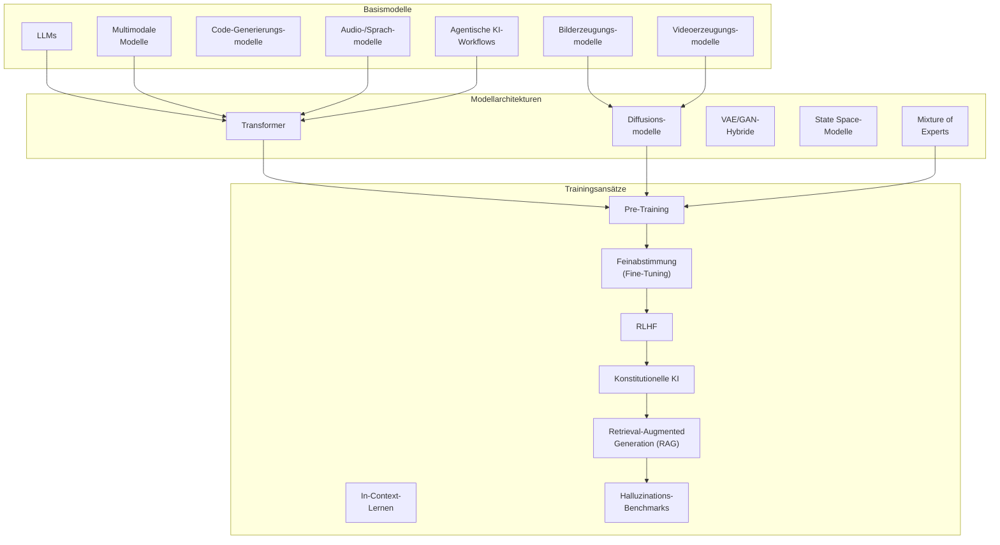
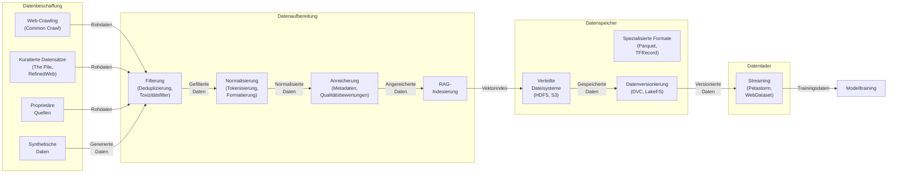
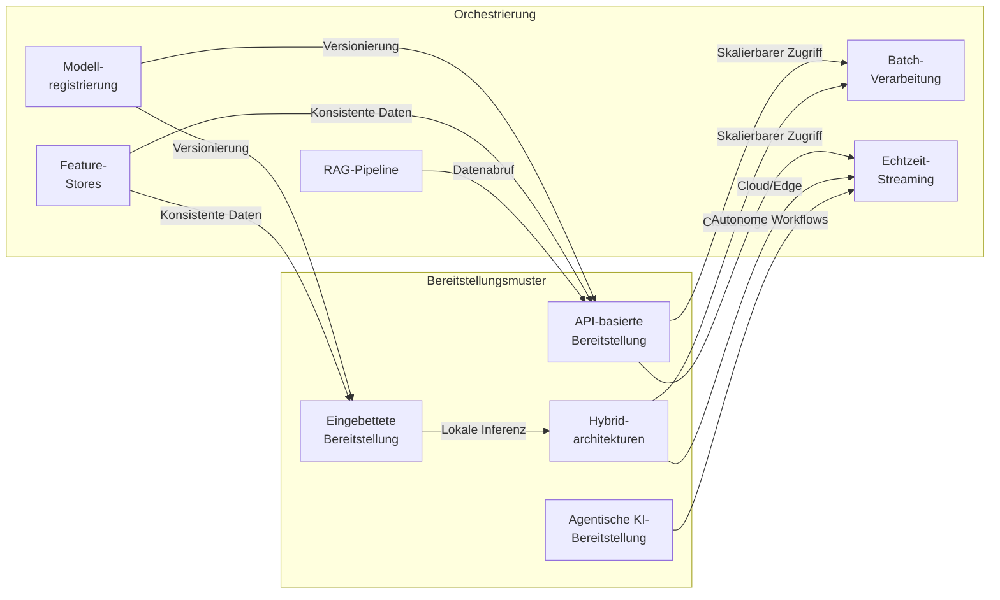
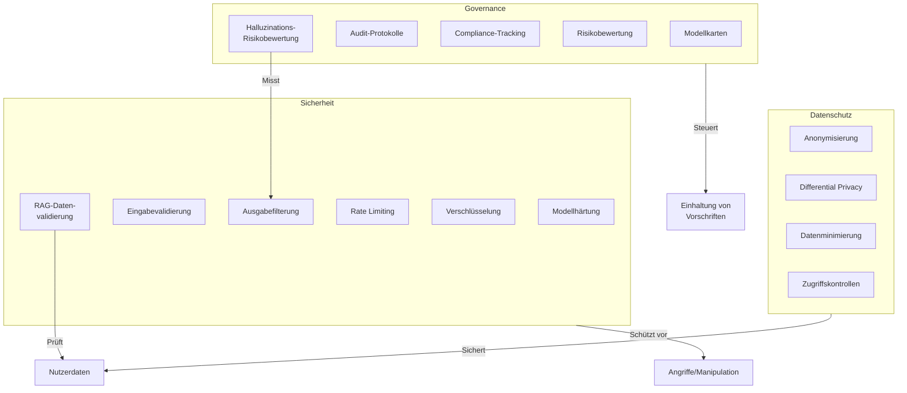
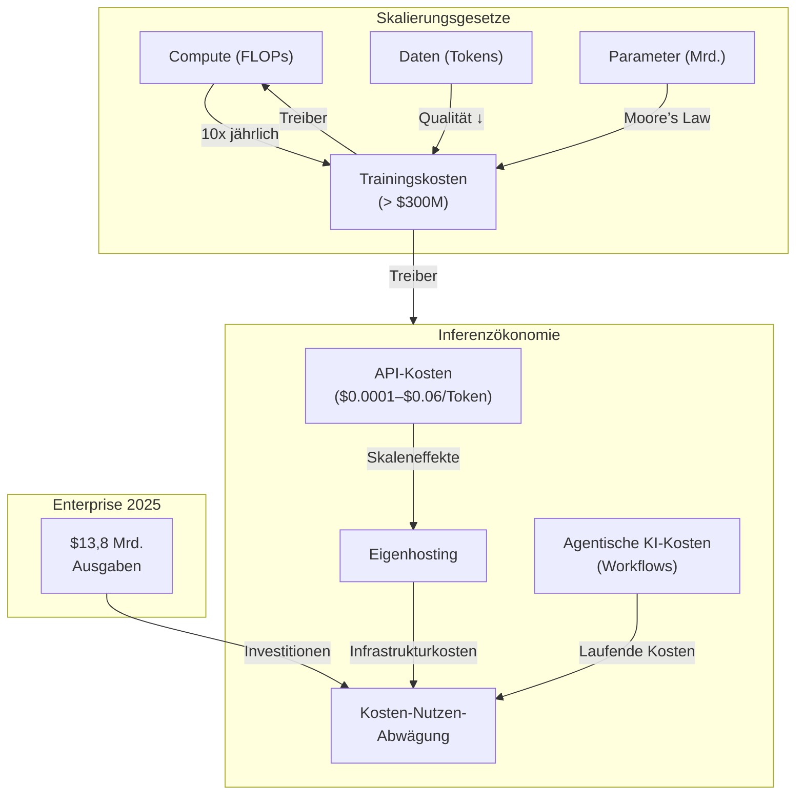

# Die GenAI-Landschaft im Dezember 2025

> Einführungs-/Präsentationsdokument.

Die Landschaft der generativen künstlichen Intelligenz (GenAI) hat sich zu einem komplexen Ökosystem aus Basismodellen, spezialisierten Architekturen, Infrastrukturkomponenten und Bereitstellungsmustern entwickelt. Dieses Dokument bietet einen umfassenden Überblick über den aktuellen Stand der Technik, die wichtigsten Technologien und Architekturmuster, die den modernen GenAI-Stack definieren (Stand: Dezember 2025).

---

## Architektur von Basismodellen

Die Basismodelle bilden das Fundament der GenAI-Landschaft. Sie umfassen textbasierte, multimodale und spezialisierte Modelle, die durch fortschrittliche Architekturen und Trainingsansätze unterstützt werden. **2025 haben sich agentische KI-Workflows und Retrieval-Augmented Generation (RAG) als zentrale Komponenten etabliert**.

### Arten von Basismodellen

**Large Language Models (LLMs)** bilden das Rückgrat der textbasierten GenAI. Diese auf Transformern basierenden Architekturen, wie GPT-4, Claude und Llama, verarbeiten und generieren menschliche Sprache durch autoregressive Vorhersage. Zu den wichtigsten Merkmalen gehören Parameterzahlen von Milliarden bis Billionen, Kontextfenster von 4K bis über 2M Token sowie emergente Fähigkeiten wie logisches Denken und Code-Generierung.

**Multimodale Modelle** integrieren mehrere Eingabemodalitäten (Text, Bilder, Audio, Video) in einheitlichen Architekturen. GPT-4V, Gemini Ultra und Claude 3 demonstrieren Vision-Sprache-Fähigkeiten, während Modelle wie DALL-E 3 und Midjourney sich auf die Text-zu-Bild-Generierung spezialisieren.

**Agentische KI-Workflows** sind 2025 zum Standard in Unternehmen geworden. Autonome KI-Agenten verwalten nun Kalender, versenden E-Mails, erstellen Berichte und steuern komplexe Arbeitsabläufe – **ohne ständige menschliche Überwachung**. Diese Agenten nutzen fortgeschrittene Planungs- und Reasoning-Fähigkeiten, um Aufgaben end-to-end zu lösen, und sind besonders in Bereichen wie Kundenservice, Marketing und Betrieb unverzichtbar geworden.

### Wichtige Modelle und Anbieter

| Modell              | Anbieter        | Parameter (geschätzt) | Modalitäten      | Lizenz      |
| ------------------- | --------------- | ---------------------- | ----------------- | ----------- |
| GPT-4 (inkl. Turbo) | OpenAI          | 1,76T                  | Text, Bild, Audio | Proprietär |
| Claude 3 (Opus)     | Anthropic       | 137B+                  | Text, Bild        | Proprietär |
| Gemini Ultra        | Google DeepMind | 1,6T                   | Text, Bild, Video | Proprietär |
| Llama 3 (70B)       | Meta            | 70B                    | Text              | Open Source |
| Stable Diffusion 3  | Stability AI    | 8B                     | Bild              | Open Source |
| Mistral Large       | Mistral AI      | 123B                   | Text              | Proprietär |

## Technologie-Stack

### Infrastruktur

**Trainingscluster** bestehen aus Tausenden von GPUs/TPUs mit Hochgeschwindigkeitsverbindungen (InfiniBand, NVLink). **Modellparallelität** verteilt Parameter über mehrere Geräte, während **Datenparallelität** Batch-Verarbeitung über Knoten hinweg ermöglicht. **Optimierer** wie AdamW und Lion verbessern die Konvergenz, während **Gradientenakkumulation** und **gemischte Präzision** den Speicherbedarf reduzieren.

**Inferenzoptimierung** umfasst Techniken wie **Quantisierung** (FP16/INT8/INT4), **KV-Caching**, **Modelldistillation** und **Sparse Attention**. **Serving-Frameworks** wie vLLM, TensorRT-LLM und TGI ermöglichen effiziente Bereitstellung mit Features wie dynamischer Batch-Verarbeitung und kontinuierlichem Batching.

### Datenpipelines

Die Datenpipeline ist 2025 durch **Datenknappheit** und die Integration von **RAG** geprägt. Unternehmen setzen zunehmend auf synthetische Daten und effizientere Datennutzung, um die Lücken zu schließen.

## Anwendungsarchitekturen

### Bereitstellungsmuster

Die Bereitstellung von GenAI-Systemen hat sich 2025 stark weiterentwickelt. **Agentische KI-Workflows** und **RAG-Pipelines** sind nun fester Bestandteil der Architektur.

**Retrieval-Augmented Generation (RAG)** ist 2025 zum **Standardansatz** geworden, um Halluzinationen zu reduzieren und Ausgaben in Echtzeitdaten zu verankern. Neue Benchmarks wie **RGB und RAGTruth** messen nun systematisch die Genauigkeit von RAG-Systemen und behandeln Halluzinationen als **technisches Problem**, das gelöst werden kann – nicht als unvermeidbare Schwäche.

### Sicherheits- und Compliance-Rahmenwerk

Die Sicherheit und Compliance von GenAI-Systemen hat 2025 durch **RAG** und **agentische KI** neue Dimensionen erhalten. Unternehmen müssen nun nicht nur Modelle, sondern auch Datenpipelines und Workflows absichern.

## Wirtschaftliche und Skalierungsdynamiken

Die Trainingskosten für Spitzenmodelle übersteigen mittlerweile **300 Millionen US-Dollar**, wobei einige Modelle sogar die **1-Milliarden-Dollar-Marke** erreichen. Die **Scaling Laws** bleiben eine zentrale Herausforderung, während sich die **Inferenzökonomie** weiterentwickelt.

**Enterprise-Adoption** : 2025 haben Unternehmen die Experimentierphase hinter sich gelassen und setzen GenAI **vollständig in der Produktion** ein. Die Ausgaben für GenAI beliefen sich 2025 auf **13,8 Milliarden US-Dollar** – ein deutlicher Anstieg gegenüber den Vorjahren. **80 % der leistungsstarken Unternehmen** nutzen KI nun für Wachstum und Innovation, nicht nur für Effizienzsteigerungen.

## Aufkommende Trends und zukünftige Richtungen

**Multimodale Integration** erweitert sich weiterhin über Text-Bild hinaus auf **Audio, Video und Sensordaten** . **Reasoning-Modelle** wie OpenAIs o1 demonstrieren verbesserte Fähigkeiten bei komplexen logischen und mathematischen Aufgaben durch iterative Verfeinerung.

**Agentische KI** wird die Art und Weise, wie Unternehmen arbeiten, weiter verändern. Von der Automatisierung repetitiver Aufgaben bis hin zur Steuerung komplexer Workflows – KI-Agenten werden zunehmend als **„digitale Kollegen“** eingesetzt, die eigenständig Entscheidungen treffen und Aufgaben erledigen.

Die GenAI-Landschaft entwickelt sich rasant weiter, wobei regelmäßig neue Architekturen, Optimierungstechniken und Anwendungsmuster entstehen. Erfolg erfordert das Verständnis sowohl der aktuellen Fähigkeiten als auch der zugrunde liegenden technologischen Trends, die die zukünftige Entwicklung vorantreiben.

> Stand: 06.12.2025  
>
> Übersetzt aus dem Englischen und aktualisiert, um die neuesten Entwicklungen seit August widerzuspiegeln.  
> Quelle: [https://cassmastern.github.io/lers-sandbox/sec_freeform/gen-ai-landscape-primer/](https://cassmastern.github.io/lers-sandbox/sec_freeform/gen-ai-landscape-primer/)
