# Single Sign-On (SSO) Admin Guide — SAML 2.0 Integration

> First I had a template, then I put together a real-life spec (2017/2018), then I turned it back into an improved template with better diagrams and removed/masked real module/app/company names, URLs, etc. Why? First, I might end up using it (SAML is still around). Second, using it as a playground to play and experiment with PlantUML. 

## 1. Overview

### Purpose

This guide provides step-by-step instructions for configuring and maintaining Single Sign-On (SSO) based on the **SAML 2.0** standard across the following internal web applications:

- **APP-A**
- **APP-B**
- **APP-C**

**Audience**
This document is intended for internal IT administrators responsible for authentication and access management.

**Scope**
Covers SSO configuration between the client's Identity Provider (IdP) — e.g. `<Azure AD / Okta / ADFS>` — and the Service Provider (SP) components of the above systems.
It does *not* cover general user management or application-level permission setup.

**Prerequisites**

- Administrative access to the Identity Provider
- Admin credentials for each application's configuration panel
- SSL/TLS certificates for all SP endpoints (valid and trusted)
- Basic understanding of SAML terminology and digital certificates
- Network connectivity between IdP and all SPs (firewall rules configured)
- Test user accounts in IdP with appropriate group memberships

## 2. Conceptual Overview

**What is SAML 2.0?**
SAML (Security Assertion Markup Language) enables secure authentication by exchanging digitally signed XML assertions between an **Identity Provider (IdP)** and **Service Providers (SPs)**.

**Authentication Flow**

1. User attempts to access APP-A/APP-B/APP-C.
2. The application redirects the user to the IdP for authentication.
3. The IdP validates credentials and issues a signed assertion.
4. The application grants access based on the assertion.

### High-Level SSO Architecture

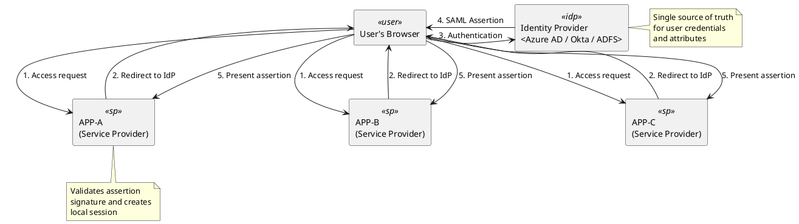

### Detailed SAML Authentication Flow

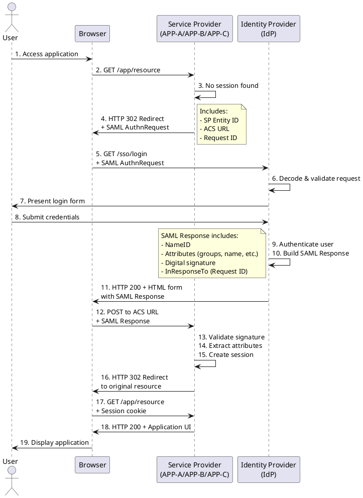

**Key Terms**


| Term                             | Description                                             |
| ---------------------------------- | --------------------------------------------------------- |
| IdP                              | The system that authenticates users (e.g. Azure AD)     |
| SP                               | The system that relies on IdP authentication (e.g. APP-A) |
| Metadata                         | XML file describing endpoints and certificates          |
| ACS (Assertion Consumer Service) | Endpoint on SP receiving login responses                |
| SLO                              | Single Logout – logs the user out of all systems       |
| Certificate                      | Used to sign and verify assertions                      |
| AuthnRequest                     | SAML authentication request from SP to IdP              |
| Assertion                        | Signed statement about user identity and attributes     |


## 3. System Components and SSO Parameters


| Component | Role             | SP Entity ID                            | ACS URL                            | SLO URL                               | Notes                      |
| ----------- | ------------------ | ----------------------------------------- | ------------------------------------ | --------------------------------------- | ---------------------------- |
| APP-A       | Service Provider | `<crm.company.com/saml/metadata>`       | `<crm.company.com/saml/acs>`       | `<crm.company.com/saml/logout>`       | Supports Single Logout     |
| APP-B | Service Provider | `<tickets.company.com/saml/metadata>`   | `<tickets.company.com/saml/acs>`   | `<tickets.company.com/saml/logout>`   | Requires user role mapping |
| APP-C | Service Provider | `<warehouse.company.com/saml/metadata>` | `<warehouse.company.com/saml/acs>` | `<warehouse.company.com/saml/logout>` | Requires user provisioning |

### System Component Relationships

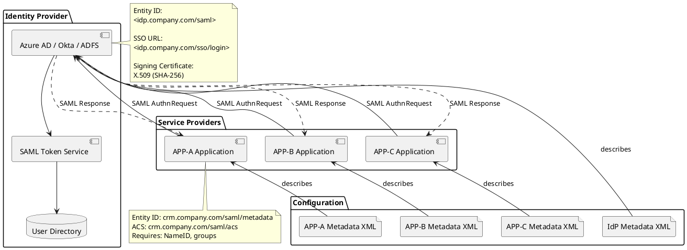


## 4. Identity Provider Integration

### 4.1 Metadata Exchange

### Metadata Exchange Process

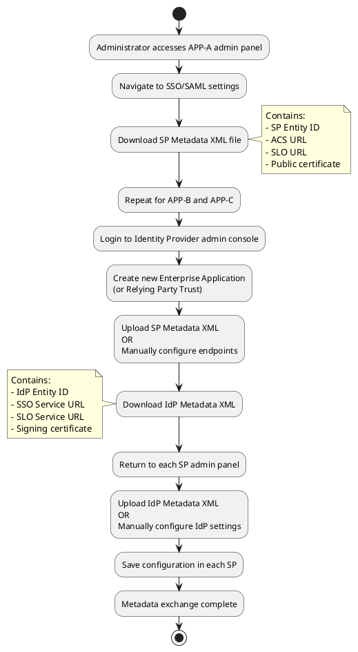

**Step-by-Step Process:**

1. **Download SP Metadata** from each component's admin page:

   - APP-A → `<URL to APP-A admin → SSO Settings → Download Metadata>`
   - APP-B → `<URL to APP-B admin → Authentication → SAML → Export Metadata>`
   - APP-C → `<URL to APP-C admin → Security → SSO → Get Metadata>`
2. **Upload SP Metadata to IdP** (as a new Enterprise Application or Relying Party).
3. **Download IdP Metadata** and provide it to each component's admin panel.

### 4.2 IdP Configuration Example (Azure AD)

### Azure AD Configuration Steps

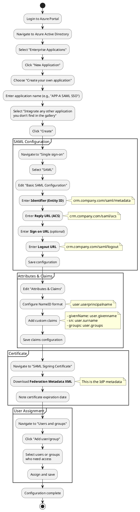

**Detailed Steps:**

1. In Azure AD → *Enterprise Applications* → *New Application* → *Create your own application*.
2. Enter:

   - **Name:** `APP-A SAML SSO`
   - **Identifier (Entity ID):** `<crm.company.com/saml/metadata>`
   - **Reply URL (ACS):** `<crm.company.com/saml/acs>`
   - **Sign on URL:** `<crm.company.com>` (optional)
   - **Logout URL:** `<crm.company.com/saml/logout>`
3. Upload the **SP certificate** (if required for assertion encryption).
4. Configure attribute mappings:

   - `user.userprincipalname` → `NameID` (format: emailAddress)
   - `user.givenname` → `givenName`
   - `user.surname` → `sn`
   - `user.groups` → `groups` (ensure group claims are enabled)
5. Assign users/groups who can sign in.
6. Download **Federation Metadata XML** from the SAML Signing Certificate section.

### 4.3 SP Configuration (Each Component)

**Location of SSO Settings:**

- **APP-A:** Admin Panel → Settings → Security → Single Sign-On
- **APP-B:** Configuration → Authentication → SAML 2.0
- **APP-C:** System Administration → User Authentication → SSO Configuration

**Configuration Steps for Each SP:**

1. Navigate to SSO/SAML settings in the admin panel
2. Choose configuration method:

   - **Option A (Recommended):** Upload IdP Metadata XML file
   - **Option B:** Manual configuration using individual fields:
     - IdP Entity ID: `<from IdP metadata>`
     - IdP SSO URL: `<from IdP metadata>`
     - IdP SLO URL: `<from IdP metadata>`
     - IdP Certificate: Paste X.509 certificate (PEM format)
3. Configure SAML settings:

   - **NameID Format:** EmailAddress (urn:oasis:names:tc:SAML:1.1:nameid-format:emailAddress)
   - **Expected Attributes:** Configure mapping (see Section 5)
   - **Signature Validation:** Enable (required)
   - **Assertion Encryption:** Enable if supported
   - **Session Timeout:** `<recommended: 8 hours>`
4. Set authentication mode:

   - **Hybrid:** Allow both SSO and local credentials (recommended for testing)
   - **SSO-Only:** Disable local authentication (production mode)
   - **Important:** Keep at least one local admin account for emergency access
5. Save configuration and note any generated SP metadata URL

### SP Configuration Decision Tree

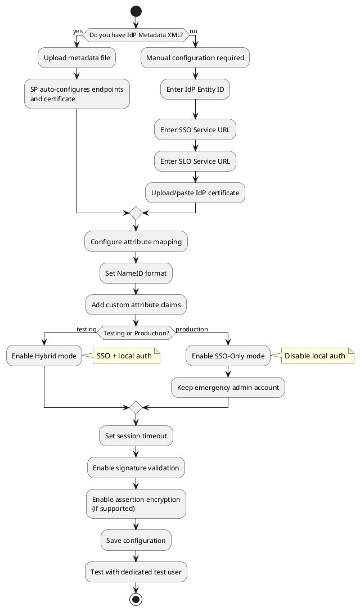


## 5. User Attribute Mapping and Role Assignment


| SAML Attribute | Local Field | Required | Example            | Data Type    |
| ---------------- | ------------- | ---------- | -------------------- | -------------- |
| `NameID`       | Username    | Yes      | `jdoe@company.com` | EmailAddress |
| `givenName`    | First Name  | Optional | `John`             | String       |
| `sn`           | Last Name   | Optional | `Doe`              | String       |
| `email`        | Email       | Optional | `jdoe@company.com` | EmailAddress |
| `groups`       | Roles       | Optional | `APP-C_Admin`  | Array/Multi  |
| `employeeId`   | Employee ID | Optional | `E12345`           | String       |

### Attribute Mapping and Provisioning Flow

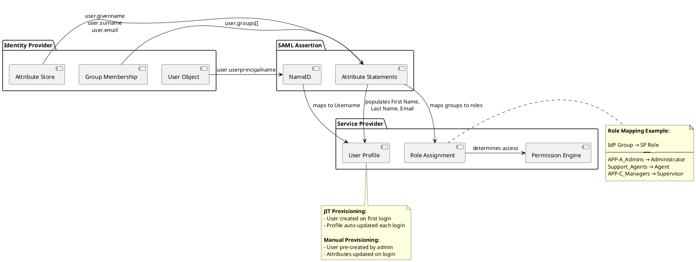

**Role Mapping Configuration**

Configure in each SP's admin panel under: *User Management → Role Mapping* or *SSO Settings → Group Mapping*

**Example Mappings:**


| IdP Group (SAML Attribute) | APP-A Role      | APP-B Role | APP-C Role |
| ---------------------------- | --------------- | ---------------- | ---------------- |
| `APP-A_Admins`               | Administrator | (no access)    | (no access)    |
| `Support_Agents`           | Standard User | Agent          | (no access)    |
| `APP-C_Managers`       | (no access)   | (no access)    | Supervisor     |
| `APP-C_Staff`          | (no access)   | (no access)    | APP-C User |
| `IT_Administrators`        | Administrator | Administrator  | Administrator  |

**Provisioning Options:**

1. **JIT (Just-In-Time) Provisioning:**

   - User account created automatically on first SSO login
   - Profile attributes updated from SAML assertion each login
   - Recommended for most scenarios
2. **Manual Provisioning:**

   - User account pre-created by administrator
   - SSO login updates existing account attributes
   - Required for APP-C (per Section 3 notes)

If group information is not provided in SAML assertion, roles must be assigned manually in the local admin UI.


## 6. Testing the Configuration

### Testing Workflow

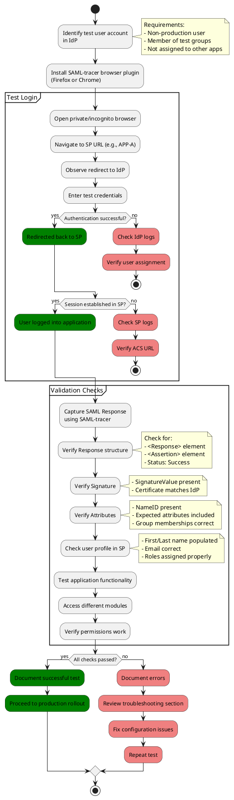

### Testing Procedure:  

#### 1. **Preparation:**  

  - Create dedicated test user account in IdP
  - Assign test user to appropriate groups (e.g., `APP-A_Test_Users`)
  - Ensure test user has no active sessions

#### 2. **Install Testing Tools:**

  - Browser: **SAML-tracer** plugin (Firefox/Chrome)
  - Alternative: Browser developer tools (Network tab)

#### 3. **Execute Test:**

   - Use private/incognito browser window
   - Attempt login to APP-A/APP-B/APP-C
   - Observe redirect to IdP login screen
   - Enter test credentials
   - Monitor SAML-tracer for SAML Response

#### 4. **Validation Checklist:**

  - ☐ User redirected to IdP
  - ☐ IdP authentication successful
  - ☐ SAML Response returned to SP
  - ☐ Session established in application
  - ☐ SAML assertion contains expected attributes
  - ☐ User profile populated correctly
  - ☐ Roles assigned as configured
  - ☐ Application functionality works

#### 5. **SAML Response Analysis:**

   Using SAML-tracer, verify:

   - `<samlp:Response>` element present
   - `<samlp:StatusCode Value="urn:oasis:names:tc:SAML:2.0:status:Success">`
   - `<saml:Assertion>` element present
   - `<Signature>` with valid `<SignatureValue>`
   - `<saml:NameID>` contains expected username
   - `<saml:AttributeStatement>` contains configured attributes

**Recommended Test Duration:** 2-4 hours per application, including troubleshooting time.

**Common Issues**

| Error                           | Possible Cause              | Resolution                                  |
| --------------------------------- | ----------------------------- | --------------------------------------------- |
| "Invalid signature"             | Certificate mismatch        | Update metadata / verify cert               |
| "No NameID found"               | Missing attribute mapping   | Adjust IdP claim rules                      |
| "ACS URL mismatch"              | Incorrect Reply URL         | Update IdP configuration                    |
| "Assertion expired"             | Clock skew between systems  | Sync NTP on all servers                     |
| "Unknown NameID format"         | NameID format not supported | Change to emailAddress format               |
| "User not found"                | JIT provisioning disabled   | Enable auto-provisioning or pre-create user |
| "Access denied"                 | Missing group membership    | Verify user groups in IdP                   |
| "Certificate validation failed" | Expired or untrusted cert   | Renew certificate                           |


## 7. Enabling and Managing SSO in Production

### Production Rollout Strategy

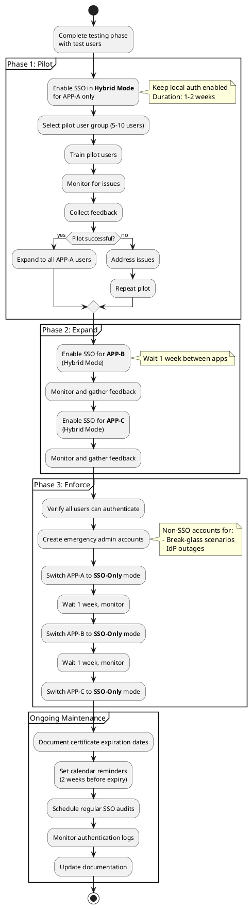

### Production Deployment Best Practices:

#### 1. Phased Rollout:

   - Enable SSO gradually per component (start with APP-A)
   - Use Hybrid mode initially (2-4 weeks)
   - Pilot with small user group before full deployment

#### 2. Emergency Access:

   - Maintain at least 2 fallback local admin accounts (non-SSO)
   - Store credentials in secure vault (e.g., KeePass, 1Password, HashiCorp Vault)
   - Test emergency accounts quarterly
   - Document break-glass procedures

#### 3. Certificate Management:

   - Document certificate expiration dates in shared calendar
   - Set reminders at: 60 days, 30 days, 14 days, 7 days before expiry
   - Plan certificate rotation during maintenance window
   - Test new certificates in staging environment first
   - Keep old certificate active for 24 hours during transition

#### 4. Enforcement Timeline:

   - Week 1-2: Pilot testing with select users
   - Week 3-4: APP-A full deployment (Hybrid mode)
   - Week 5: APP-B deployment (Hybrid mode)
   - Week 6: APP-C deployment (Hybrid mode)
   - Week 7+: Switch to SSO-Only mode (one app per week)

#### 5. **Monitoring:**

   - Enable authentication logging in all SPs
   - Set up alerts for:
     - Failed SSO attempts (threshold: 5 per user per hour)
     - Certificate expiration warnings
     - Metadata update notifications
   - Review logs weekly for anomalies

## 8. Single Logout (SLO)

### Single Logout Flow

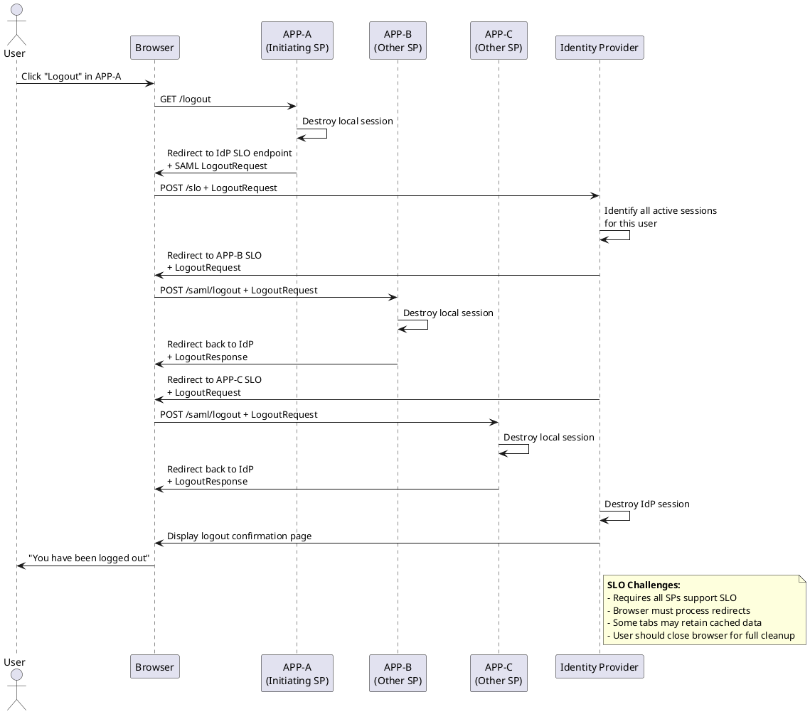

### SLO Configuration:

If SLO is supported by all components, enable global logout endpoints:


| Component | SLO Endpoint                          | Supported | Notes                        |
| ----------- | --------------------------------------- | ----------- | ------------------------------ |
| APP-A       | `<crm.company.com/saml/logout>`       | Yes       | SP-initiated & IdP-initiated |
| APP-B | `<tickets.company.com/saml/logout>`   | Yes       | SP-initiated only            |
| APP-C | `<warehouse.company.com/saml/logout>` | Yes       | IdP-initiated only           |
| IdP       | `<idp.company.com/slo>`               | Yes       | Global logout endpoint       |

#### SLO Types

1. **SP-Initiated Logout:**

   - User clicks logout in application (e.g., APP-A)
   - Application sends LogoutRequest to IdP
   - IdP notifies all other SPs
   - User logged out everywhere
2. **IdP-Initiated Logout:**

   - User logs out from IdP portal
   - IdP sends LogoutRequest to all SPs
   - Each SP destroys local session

**Configuration Steps:**

1. In each SP admin panel:

   - Enable "Single Logout" feature
   - Configure SLO endpoint URL
   - Set SLO binding to HTTP-POST or HTTP-Redirect (match IdP requirement)
   - Test SLO with pilot users
2. In IdP admin panel:

   - Verify all SP SLO endpoints are registered
   - Enable global logout functionality
   - Test IdP-initiated logout

**Known Limitations:**

- Some browsers may maintain cached sessions; users should close all browser tabs for complete logout
- SLO requires all SPs to support the feature; if one SP fails, others may retain sessions
- Third-party applications not integrated with SAML will not be logged out
- Mobile apps may require separate logout handling

**Best Practices:**

- Display clear logout confirmation message to users
- Advise users to close browser after logout on shared computers
- Monitor SLO failures in logs
- Consider implementing session timeout as backup to manual logout


## 9. Troubleshooting and Logs

### Troubleshooting Decision Tree

```puml
@startuml
start

:SSO Issue Reported;

if (Can user reach login page?) then (no)
  :Check network connectivity;
  :Verify DNS resolution;
  :Check firewall rules;
  stop
else (yes)
endif

if (Does redirect to IdP occur?) then (no)
  #LightCoral:SP Configuration Issue;
  :Check SP metadata;
  :Verify IdP SSO URL;
  :Review SP logs;
  stop
else (yes)
endif

if (Can user authenticate at IdP?) then (no)
  #LightCoral:IdP Issue;
  :Verify user credentials;
  :Check user assignment in IdP;
  :Review IdP logs;
  stop
else (yes)
endif

if (Is SAML Response returned?) then (no)
  #LightCoral:IdP Configuration Issue;
  :Check IdP metadata;
  :Verify ACS URL in IdP;
  :Check IdP signing certificate;
  stop
else (yes)
endif

if (Does SP accept the assertion?) then (no)
  #LightCoral:SP Validation Issue;
  :Verify signature validation;
  :Check certificate match;
  :Verify clock sync (NTP);
  :Check assertion expiration;
  stop
else (yes)
endif

if (Are attributes populated?) then (no)
  #LightCoral:Attribute Mapping Issue;
  :Check IdP claim configuration;
  :Verify SP attribute mapping;
  :Review SAML Response content;
  stop
else (yes)
endif

if (Are roles assigned correctly?) then (no)
  #LightCoral:Role Mapping Issue;
  :Check group membership in IdP;
  :Verify role mapping configuration;
  :Check SP provisioning settings;
  stop
else (yes)
endif

#Green:SSO Working Correctly;
stop

@enduml
```

### Log Locations


| Component      | Log Location                                        | Access Method                               |
| ---------------- | ----------------------------------------------------- | --------------------------------------------- |
| APP-A            | `<Admin Panel → System → Logs → Authentication>` | Web UI or SSH:`/var/log/crm/auth.log`       |
| APP-B      | `<Admin → Reports → System Logs → SAML>`         | Web UI or SSH:`/var/log/ticketing/saml.log` |
| APP-C      | `<System Admin → Audit Logs → SSO Events>`        | Web UI or SSH:`/var/log/warehouse/sso.log`  |
| IdP (Azure AD) | Azure Portal → Sign-in logs                        | Filter by application name                  |
| IdP (Okta)     | Reports → System Log                               | Filter by app and event type                |

### Enabling Debug Mode

For more verbose logging during troubleshooting:

**APP-A:**

```bash
# Edit configuration file
sudo nano /etc/crm/saml.conf

# Set debug level
saml_debug_level=DEBUG

# Restart service
sudo systemctl restart crm-web
```

**APP-B:**

```bash
# Enable via admin UI
Admin → Configuration → Authentication → SAML → Debug Mode: ON

# Or via config file
sudo nano /etc/ticketing/auth.conf
debug_saml=true
sudo systemctl restart ticketing
```

**APP-C:**

```bash
# Enable via admin UI
System Admin → SSO Configuration → Advanced → Verbose Logging: Enabled
```

⚠️ **Warning:** Disable debug mode after troubleshooting as it may expose sensitive data in logs.

### Collecting Diagnostic Data

When opening a support ticket, collect:

#### 1. **SAML Response** (from SAML-tracer):

   - Save complete HTTP transaction
   - Redact sensitive values (passwords, tokens)

#### 2. Error Messages:

   - Exact error text from UI
   - Timestamp of occurrence
   - Affected user(s)

#### 3. Log Excerpts:

   - SP logs around error timestamp (±5 minutes)
   - IdP sign-in logs for the user/timeframe

#### 4. Configuration Screenshots:

   - SP SAML settings (hide certificates)
   - IdP application configuration
   - Attribute/claim mappings

#### 5. Environment Details:

   - Browser type and version
   - User's network location (on-premise/VPN/remote)
   - IdP tenant/instance information

### Common Error Patterns

```
# Clock skew error
Error: "NotBefore condition not met" or "Assertion expired"
Solution: Sync NTP on all servers, allow 5-minute clock skew tolerance

# Certificate validation error  
Error: "Unable to validate signature"
Solution: Update IdP metadata, verify certificate chain

# Missing NameID
Error: "NameID is required but not present"
Solution: Configure NameID claim in IdP

# ACS URL mismatch
Error: "Invalid ACS URL" or "Recipient validation failed"
Solution: Verify ACS URL matches exactly in both IdP and SP configurations
```


## 10. Security and Maintenance

### Security Best Practices

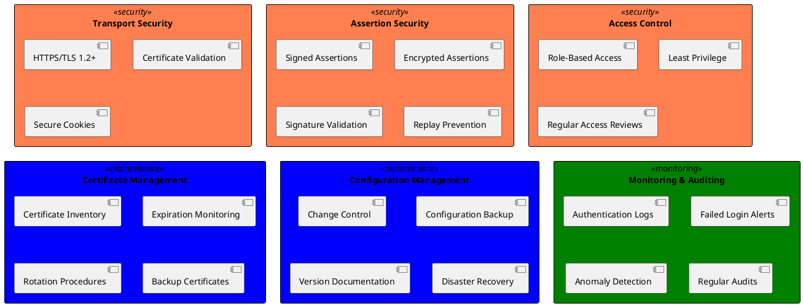

### Security Checklist

▢  **Transport Layer Security:**

- [ ] All endpoints use HTTPS (TLS 1.2 or higher)
- [ ] Valid SSL/TLS certificates from trusted CA
- [ ] Certificate pinning configured where supported
- [ ] Secure cipher suites enabled (disable weak ciphers)

▢  **SAML Assertion Security:**

- [ ] Assertions are signed by IdP
- [ ] SP validates all assertion signatures
- [ ] Assertions are encrypted (if supported)
- [ ] Assertion validity period is limited (recommended: 5 minutes)
- [ ] Recipient validation enabled
- [ ] InResponseTo validation enabled (prevents replay attacks)

▢  **Access Control:**

- [ ] SSO configuration restricted to administrators only
- [ ] Multi-factor authentication required for admin accounts
- [ ] Emergency admin accounts secured in vault
- [ ] Regular access reviews performed (quarterly)
- [ ] Principle of least privilege enforced

▢  **Cryptographic Standards:**

- [ ] SHA-256 or higher for signing algorithms
- [ ] RSA 2048-bit or higher key length
- [ ] Avoid SHA-1 (deprecated)

### Certificate Rotation Procedure

#### Certificate Rotation Process

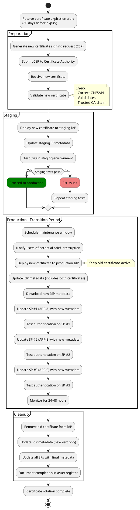

#### Certificate Rotation Timeline:

| Time Before Expiry | Action                                   |
| -------------------- | ------------------------------------------ |
| 60 days            | Alert triggered, generate new CSR        |
| 45 days            | Receive new certificate, test in staging |
| 30 days            | Deploy to production (dual-cert mode)    |
| 28 days            | Update all SPs with new metadata         |
| 14 days            | Remove old certificate                   |

### Maintenance Schedule

| Task                             | Frequency | Owner         | Notes                       |
| ---------------------------------- | ----------- | --------------- | ----------------------------- |
| Review authentication logs       | Weekly    | Security Team | Check for anomalies         |
| Test emergency admin accounts    | Quarterly | IT Operations | Verify non-SSO access works |
| Access review (user assignments) | Quarterly | App Owners    | Remove inactive users       |
| Vulnerability scanning           | Monthly   | Security Team | Scan SP/IdP infrastructure  |
| Certificate expiration check     | Monthly   | IT Operations | Review all certificates     |
| SSO configuration backup         | Weekly    | IT Operations | Backup metadata and configs |
| Disaster recovery test           | Annually  | IT Leadership | Full SSO restoration test   |
| Documentation review/update      | Quarterly | Documentation | Update procedures as needed |

### Configuration Backup Procedures

#### 1. **Backup Items:**

   - IdP metadata XML files
   - SP metadata XML files
   - Certificate files (.crt, .key)
   - SP configuration files
   - Role mapping configuration
   - Attribute mapping configuration

#### 2. **Backup Location:**

   - Secure file share: `\\backup-server\sso-configs\`
   - Version control: Git repository (without private keys)
   - Encrypted offline backup: External drive in safe

#### 3. **Backup Script Example:**

```bash
#!/bin/bash
# SSO Configuration Backup Script

BACKUP_DIR="/backup/sso-configs/$(date +%Y%m%d)"
mkdir -p "$BACKUP_DIR"

# Backup APP-A configuration
scp admin@crm-server:/etc/crm/saml.conf "$BACKUP_DIR/crm-saml.conf"

# Backup APP-B configuration
scp admin@ticketing-server:/etc/ticketing/auth.conf "$BACKUP_DIR/ticketing-auth.conf"

# Backup APP-C configuration
scp admin@warehouse-server:/etc/warehouse/sso.conf "$BACKUP_DIR/warehouse-sso.conf"

# Backup metadata files
cp /data/sso/metadata/*.xml "$BACKUP_DIR/"

# Create encrypted archive
tar czf - "$BACKUP_DIR" | openssl enc -aes-256-cbc -e > "$BACKUP_DIR.tar.gz.enc"

echo "Backup completed: $BACKUP_DIR.tar.gz.enc"
```

### Disaster Recovery Plan

#### Procedure in case of SSO outage

##### 1. Immediate Actions
- a. Enable local authentication mode (if available)  
- b. Use emergency admin accounts  
- c. Notify users via alternative channels (email, Slack)  

##### 2. Restoration Steps
- Identify root cause (IdP down, certificate expired, configuration error)
- Restore from last known good configuration backup
- Re-establish metadata exchange if corrupted
- Test with single user before enabling for all

##### 3. Recovery Time Objectives

- Detection: < 15 minutes
- Initial response: < 30 minutes
- Full restoration: < 2 hours


## 11. Appendices

### A. Example Metadata (SP → IdP)

```xml
<?xml version="1.0" encoding="UTF-8"?>
<EntityDescriptor 
    xmlns="urn:oasis:names:tc:SAML:2.0:metadata"
    entityID="https://crm.company.com/saml/metadata">
  
    <SPSSODescriptor 
        AuthnRequestsSigned="true" 
        WantAssertionsSigned="true"
        protocolSupportEnumeration="urn:oasis:names:tc:SAML:2.0:protocol">
      
        <KeyDescriptor use="signing">
            <KeyInfo xmlns="http://www.w3.org/2000/09/xmldsig#">
                <X509Data>
                    <X509Certificate>
                        MIIDXTCCAkWgAwIBAgIJAKZ...
                    </X509Certificate>
                </X509Data>
            </KeyInfo>
        </KeyDescriptor>
      
        <SingleLogoutService 
            Binding="urn:oasis:names:tc:SAML:2.0:bindings:HTTP-POST"
            Location="https://crm.company.com/saml/logout"/>
      
        <NameIDFormat>
            urn:oasis:names:tc:SAML:1.1:nameid-format:emailAddress
        </NameIDFormat>
      
        <AssertionConsumerService 
            Binding="urn:oasis:names:tc:SAML:2.0:bindings:HTTP-POST"
            Location="https://crm.company.com/saml/acs"
            index="0"
            isDefault="true"/>
          
    </SPSSODescriptor>
</EntityDescriptor>
```

### B. Example SAML Assertion

```xml
<?xml version="1.0" encoding="UTF-8"?>
<saml:Assertion 
    xmlns:saml="urn:oasis:names:tc:SAML:2.0:assertion"
    ID="_8e8dc5f69a98cc4c1ff3427e5ce34606fd672f91e6"
    Version="2.0"
    IssueInstant="2025-10-06T14:30:00Z">
  
    <saml:Issuer>https://idp.company.com/saml</saml:Issuer>
  
    <Signature xmlns="http://www.w3.org/2000/09/xmldsig#">
        <SignedInfo>
            <CanonicalizationMethod Algorithm="http://www.w3.org/2001/10/xml-exc-c14n#"/>
            <SignatureMethod Algorithm="http://www.w3.org/2001/04/xmldsig-more#rsa-sha256"/>
            <Reference URI="#_8e8dc5f69a98cc4c1ff3427e5ce34606fd672f91e6">
                <Transforms>
                    <Transform Algorithm="http://www.w3.org/2000/09/xmldsig#enveloped-signature"/>
                    <Transform Algorithm="http://www.w3.org/2001/10/xml-exc-c14n#"/>
                </Transforms>
                <DigestMethod Algorithm="http://www.w3.org/2001/04/xmlenc#sha256"/>
                <DigestValue>...</DigestValue>
            </Reference>
        </SignedInfo>
        <SignatureValue>...</SignatureValue>
        <KeyInfo>
            <X509Data>
                <X509Certificate>...</X509Certificate>
            </X509Data>
        </KeyInfo>
    </Signature>
  
    <saml:Subject>
        <saml:NameID Format="urn:oasis:names:tc:SAML:1.1:nameid-format:emailAddress">
            jdoe@company.com
        </saml:NameID>
        <saml:SubjectConfirmation Method="urn:oasis:names:tc:SAML:2.0:cm:bearer">
            <saml:SubjectConfirmationData 
                NotOnOrAfter="2025-10-06T14:35:00Z"
                Recipient="https://crm.company.com/saml/acs"
                InResponseTo="_ae3f45c6b8d9e2f1"/>
        </saml:SubjectConfirmation>
    </saml:Subject>
  
    <saml:Conditions 
        NotBefore="2025-10-06T14:29:00Z"
        NotOnOrAfter="2025-10-06T14:35:00Z">
        <saml:AudienceRestriction>
            <saml:Audience>https://crm.company.com/saml/metadata</saml:Audience>
        </saml:AudienceRestriction>
    </saml:Conditions>
  
    <saml:AuthnStatement 
        AuthnInstant="2025-10-06T14:30:00Z"
        SessionIndex="_be9967abd904ddcae3c0eb4189adbe3f71e327cf93">
        <saml:AuthnContext>
            <saml:AuthnContextClassRef>
                urn:oasis:names:tc:SAML:2.0:ac:classes:PasswordProtectedTransport
            </saml:AuthnContextClassRef>
        </saml:AuthnContext>
    </saml:AuthnStatement>
  
    <saml:AttributeStatement>
        <saml:Attribute Name="givenName">
            <saml:AttributeValue>John</saml:AttributeValue>
        </saml:Attribute>
        <saml:Attribute Name="sn">
            <saml:AttributeValue>Doe</saml:AttributeValue>
        </saml:Attribute>
        <saml:Attribute Name="email">
            <saml:AttributeValue>jdoe@company.com</saml:AttributeValue>
        </saml:Attribute>
        <saml:Attribute Name="groups">
            <saml:AttributeValue>APP-A_Admins</saml:AttributeValue>
            <saml:AttributeValue>IT_Department</saml:AttributeValue>
        </saml:Attribute>
    </saml:AttributeStatement>
  
</saml:Assertion>
```

### C. Glossary

| Term             | Meaning                                                            |
| ------------------ | -------------------------------------------------------------------- |
| ACS              | Assertion Consumer Service - SP endpoint receiving SAML responses  |
| Assertion        | Signed XML statement containing user identity and attributes       |
| Attribute        | User property (e.g., email, groups) passed in SAML assertion       |
| AuthnRequest     | SAML authentication request from SP to IdP                         |
| Binding          | Protocol for transporting SAML messages (HTTP-POST, HTTP-Redirect) |
| Certificate      | X.509 digital certificate used to sign and verify assertions       |
| Entity ID        | Unique identifier for IdP or SP in SAML metadata                   |
| IdP              | Identity Provider - system that authenticates users                |
| JIT Provisioning | Just-In-Time user creation on first SSO login                      |
| Metadata         | XML configuration file describing endpoints and certificates       |
| NameID           | Primary user identifier in SAML assertion                          |
| Relying Party    | Another term for Service Provider (used in ADFS)                   |
| SAML             | Security Assertion Markup Language                                 |
| SLO              | Single Logout - logs user out of all connected systems             |
| SP               | Service Provider - application relying on IdP authentication       |
| SSO              | Single Sign-On - authenticate once, access multiple systems        |

### D. References

- **OASIS SAML 2.0 Specification:**
  https://docs.oasis-open.org/security/saml/v2.0/
- **SAML 2.0 Technical Overview:**
  http://docs.oasis-open.org/security/saml/Post2.0/sstc-saml-tech-overview-2.0.html
- **Azure AD SAML Protocol Documentation:**
  https://docs.microsoft.com/en-us/azure/active-directory/develop/single-sign-on-saml-protocol
- **Okta SAML Configuration Guide:**
  https://developer.okta.com/docs/guides/build-sso-integration/saml2/overview/
- **ADFS SAML Documentation:**
  https://docs.microsoft.com/en-us/windows-server/identity/ad-fs/
- **Internal IT Security Policy:**
  `<Link to organization's security policy document>`
- **Vendor-Specific Documentation:**
    - APP-A SSO Setup: `<URL>`
    - APP-B SAML Guide: `<URL>`
    - APP-C Authentication Docs: `<URL>`

### E. Revision History

| Version | Date       | Author             | Changes                        |
| --------- | ------------ | -------------------- | -------------------------------- |
| 1.0     | 2018-11-05 | IT Operations Team | Initial document creation      |
| 1.1     | `<DATE>`   | `<AUTHOR>`         | Added PlantUML diagrams        |
| 1.2     | `<DATE>`   | `<AUTHOR>`         | Updated certificate procedures |

### F. Contact Information

**For SSO-Related Issues:**

- **IT Help Desk:** `<helpdesk@company.com>` | Ext: `<1234>`
- **SSO Administrators:** `<sso-admins@company.com>`
- **Security Team:** `<security@company.com>`

**Escalation Path:**

1. Level 1: IT Help Desk (initial triage)
2. Level 2: SSO Administrator (configuration issues)
3. Level 3: Identity Management Team (complex troubleshooting)
4. Level 4: Vendor Support (product-specific issues)

---

*This guide should be reviewed and updated quarterly or whenever significant changes are made to the SSO infrastructure.*
