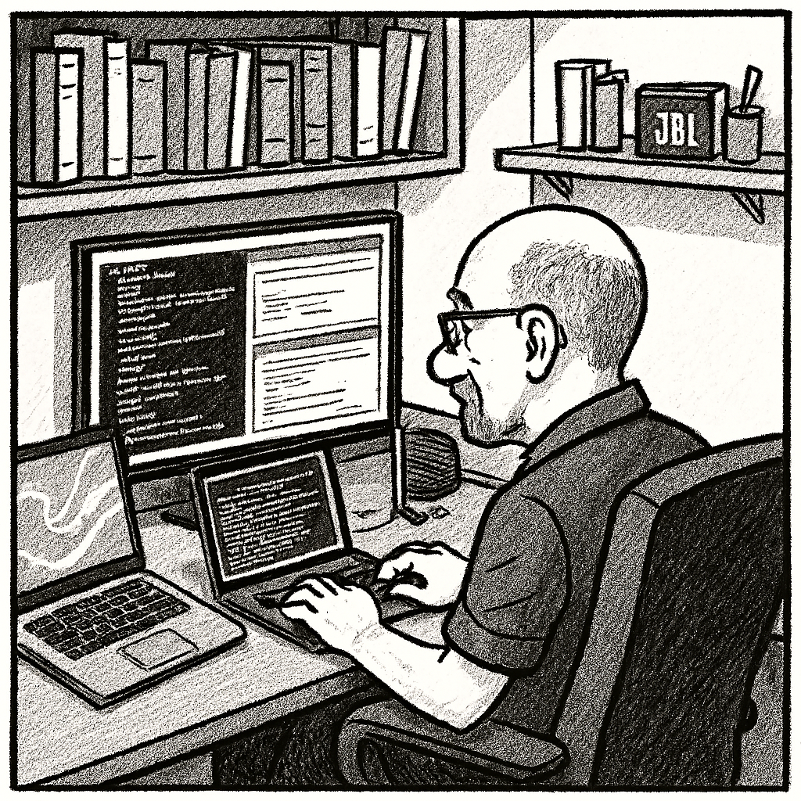

# What's in Here?

This site contains writing samples that I aimed to design so that they remain relevant and useful in my future endeavours. These include:

- a report on how this site was developed and deployed
- cross-platform architecture descriptions of the three cloud giants, Amazon, Google, and Microsoft
- a comparative glossary of cloud/DevOps terms across the corresponding three cloud platforms, AWS, GCP, and MS Azure
- a system description of a hypthetical Jakarta enterprise app on Azure
- a series of topics on contemporary networking and security
- other glossaries and cheatsheets, such as those on OSS (Operational Support Systems) and computer networking
- perhaps a non-traditional résumé with some references (under consideration)
- a final piece of writing sample, a "technical memoir" on a 'coarse-grain Java business objects' project from the pre-cloud era

No (or very little) late-night easy reading.

PS: And yes, I was using em-dashes long before AI hackneyed them to death.

