# Taxi  
Some diagrams here.

Below is a representation of an `Order`’s lifecycle as managed by SanFrancisco's object framework:  

<!-- ALT:> Test diagram for testing accessibility metadata injection -->

<!-- DESC: Test diagram for testing accessibility metadata injection by js/alt-inject.js or js/alt-inject-closest.js. Courtesy of ProGenAI Hambot. -->  

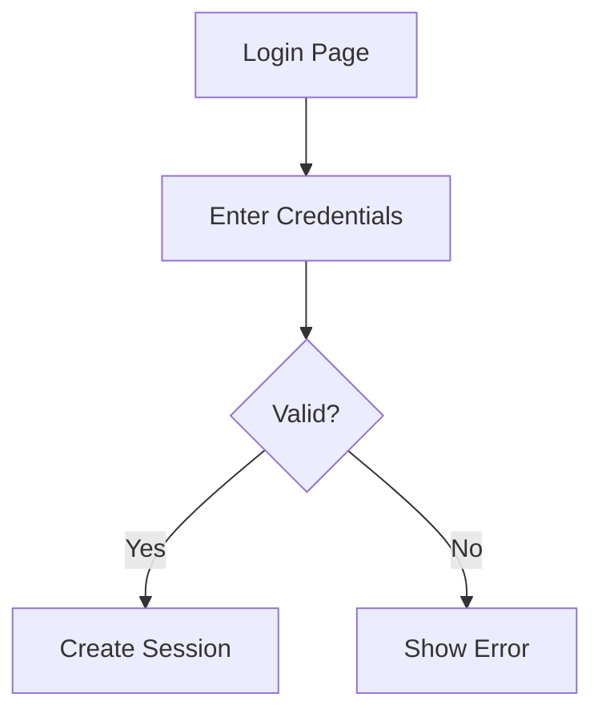

Another diagram.

<!-- ALT: This diagram shows a simple state transition from idle to active -->

<!-- DESC: The diagram represents a basic lifecycle with two states: idle and active. -->

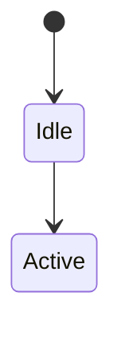

## Admonitions  
Some admonitions here.

Nested admonitions:  

!!! note "Outer Note"

    Lorem ipsum dolor sit amet, consectetur adipiscing elit. Nulla et euismod
    nulla. Curabitur feugiat, tortor non consequat finibus, justo purus auctor
    massa, nec semper lorem quam in massa.

    !!! note "Inner Note"

        Lorem ipsum dolor sit amet, consectetur adipiscing elit. Nulla et euismod
        nulla. Curabitur feugiat, tortor non consequat finibus, justo purus auctor
        massa, nec semper lorem quam in massa.

## IBM SanFrancisco Diagrams - Converted to Sunset Theme

### Architecture Overview
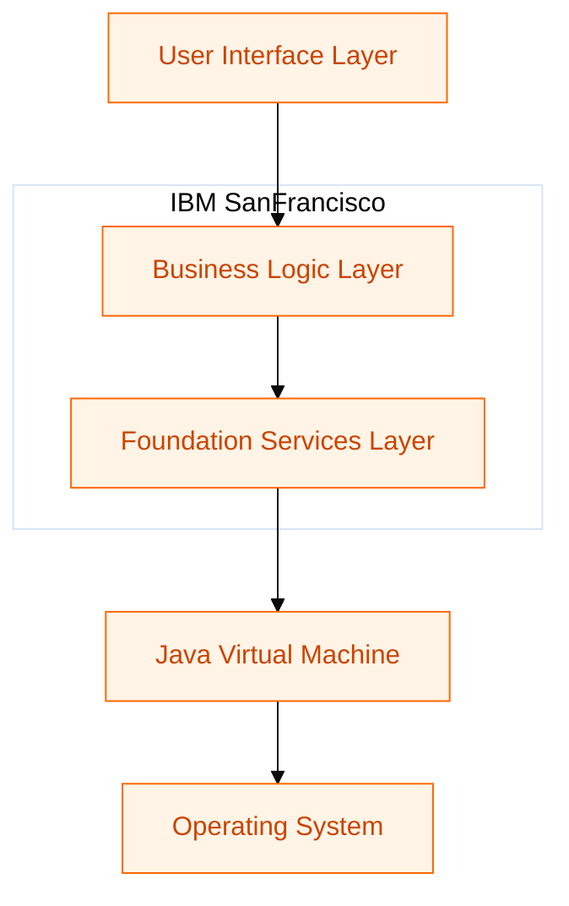

### Foundation Services Class Diagram
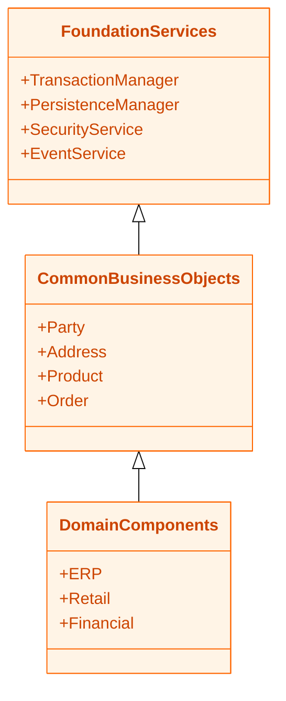

### Order Class Diagram

### Order Processing Sequence
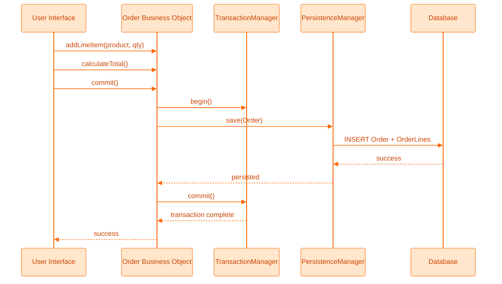

### Three-Tier Architecture
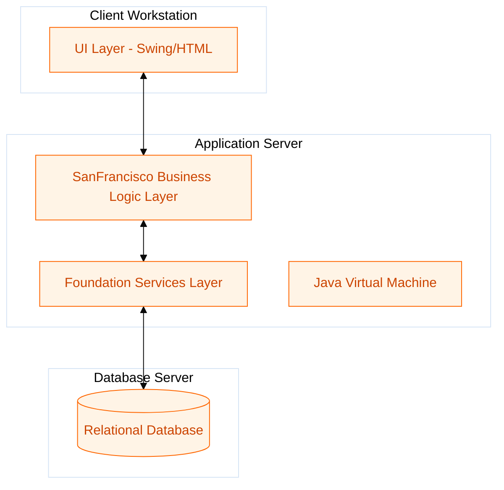

### Order State Machine
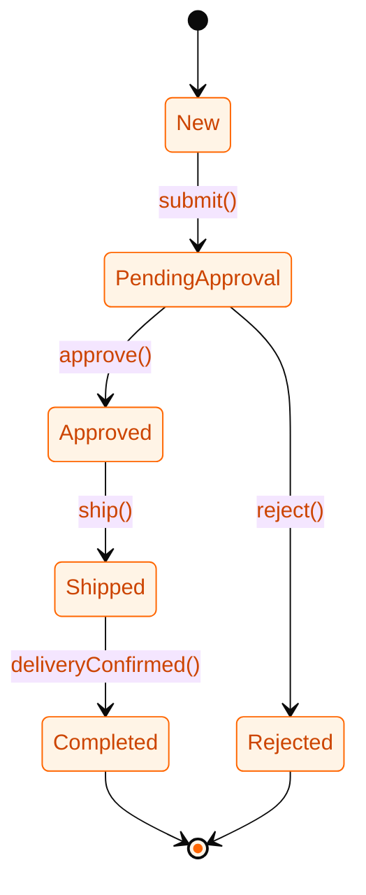

## IBM SanFrancisco -  Sunset Theme (correct variables)

### Architecture Overview
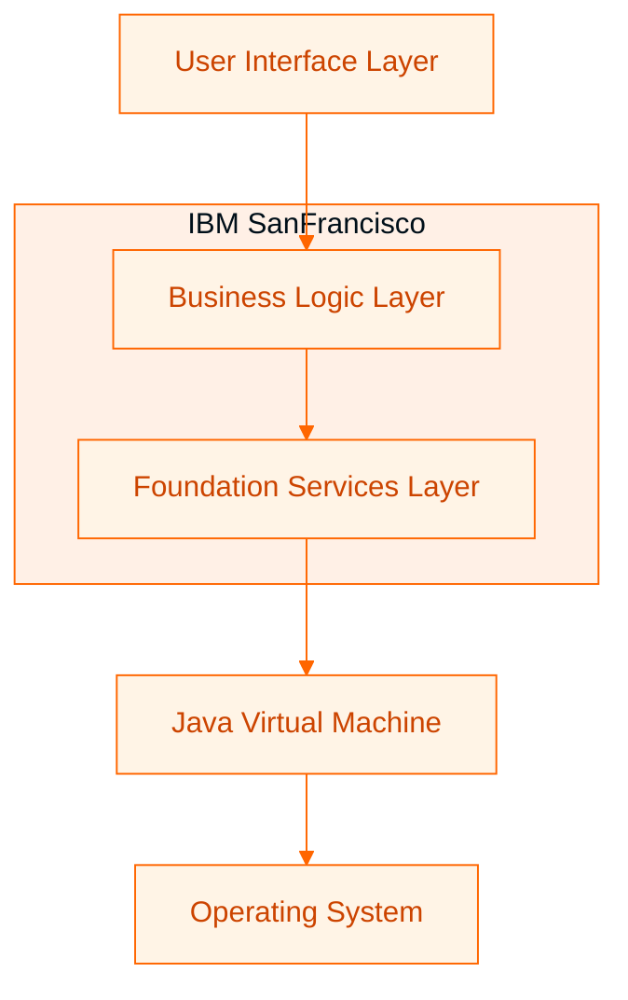

### Foundation Services Class Diagram
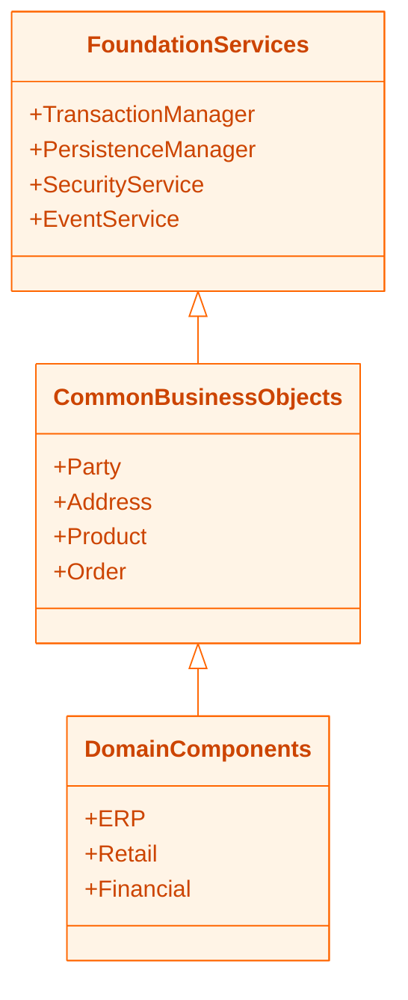

### Order Class Diagram
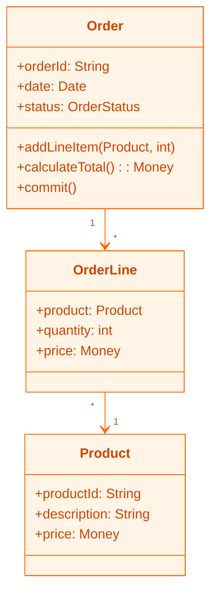

### Order Processing Sequence

### Three-Tier Architecture

### Order State Machine

## A pie chart

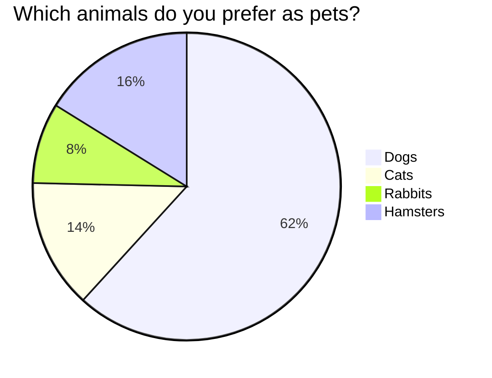