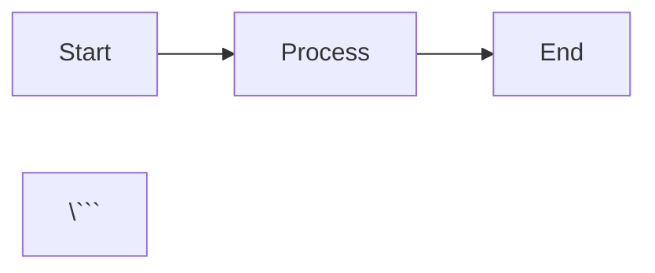
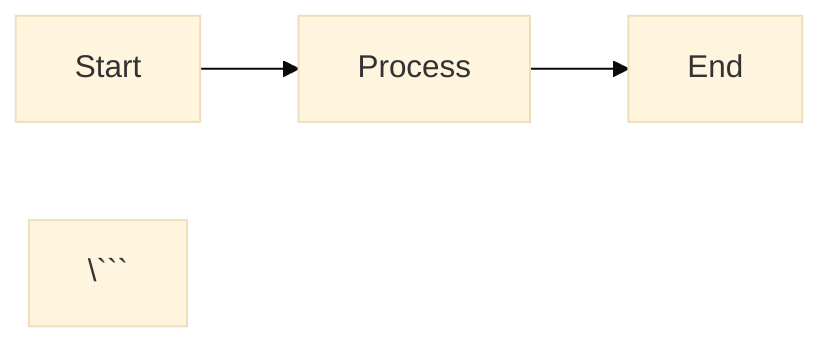
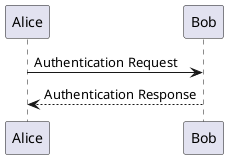

# MkDocs Material Documentation Infrastructure

A production-ready, feature-rich documentation platform built on MkDocs Material with Docker containerization. This project serves as both a **documentation infrastructure template** and a **learning playground** for exploring features of MkDocs, Material (theme), as well as technical content architecture and development in general.

## Project Purpose

### Purpose 1: Documentation Infrastructure

A fully-configured, reproducible documentation system with:

- **Multi-format diagram support** (Mermaid, PlantUML, Graphviz)
- **Accessibility-first** approach with automated ARIA metadata injection
- **Theme-aware diagrams** that switch seamlessly between light/dark modes
- **Interactive diagram zoom** with pan and scroll/pinch-to-zoom support
- **OpenAPI documentation** support via Swagger UI support
- **Analytics integration** with Google Analytics 4 and cookie consent
- **Advanced navigation** with awesome-pages plugin for flexible page organization
- **Enhanced search** with highlighting and suggestions
- **Dockerized deployment** for consistent environments

## Architecture

### File Structure

```
.
├── docs/                              # Documentation source
│   ├── js/                            # Custom JavaScript
│   │   ├── alphabet-auto.js           # Navigable alphabet instead of page-level TOC  
│   │   ├── mermaid.min.js             # Mermaid library (local)
│   │   ├── diagram-utils.js           # Shared utilities for diagram handling
│   │   ├── diagram-theme-switcher.js  # PlantUML/Graphviz theme switching
│   │   ├── diagram-zoom.js            # Interactive zoom/pan functionality
│   │   └── seamaiden.js               # Mermaid theme initialization
│   ├── css/                           # Custom stylesheets
│   │   ├── diagram-zoom.css           # Lightbox styling
│   │   ├── color-vars.css             # CSS custom properties
│   │   ├── swagger-custom.css         # Swagger UI theming
│   │   ├── alphabet.css               # Styles for glossary topics
│   │   └── cm-logo.css                # Logo styling
│   └── img/                           # Images and branding
│       ├── logo.svg                   # Site logo
│       └── favicon.ico                # Site favicon
├── hooks/                             # Python build hooks
│   └── accessibility-injector.py      # SVG metadata injection
├── mkdocs.yml                         # MkDocs configuration
├── requirements.txt                   # Docker image build directive
├── Dockerfile                         # Container definition
└── README.md                          # This file
```

### Component Interaction

```
┌─────────────────────────────────────────────────────────────┐
│                     MkDocs Build Process                    │
├─────────────────────────────────────────────────────────────┤
│  1. Markdown → HTML (MkDocs core)                           │
│  2. Diagram rendering (Mermaid/PlantUML/Graphviz plugins)   │
│     - PlantUML via local server (http://IP-ADDRESS:8080)    │
│  3. Accessibility metadata injection (Python hook)          │
│  4. Asset bundling (JavaScript/CSS)                         │
│  5. Page organization (awesome-pages plugin)                │
└─────────────────────────────────────────────────────────────┘
                              ↓
┌───────────────────────────────────────────────────────────────┐
│                    Runtime (Browser)                          │
├───────────────────────────────────────────────────────────────┤
│  mermaid.min.js            → Mermaid rendering engine         │
│  diagram-utils.js          → Shared constants & helpers       │
│  seamaiden.js              → Mermaid initialization & themes  │
│  diagram-theme-switcher.js → PlantUML/Graphviz themes         │
│  diagram-zoom.js           → Interactive zoom functionality   │
│  diagram-zoom.css          → Visual styling                   │
│  Google Analytics          → Usage tracking (with consent)    │
└───────────────────────────────────────────────────────────────┘
```

---

## Getting Started

### Prerequisites

- Docker installed and running
- Git (for cloning the repository)
- **PlantUML Server** (required for PlantUML diagram rendering)

### Quick Start

#### 1. Start PlantUML Server

**Pull and run the PlantUML server container:**

```bash
# Pull the image (one-time)
docker pull plantuml/plantuml-server

# Run the server
docker run -d -p 8080:8080 --name plantuml-server plantuml/plantuml-server
```

**Verify it's running:**

```bash
# Check container status
docker ps | grep plantuml-server

# Test the server
curl http://localhost:8080/plantuml/
```

You should see the PlantUML web interface at `http://localhost:8080/plantuml/`

**Important:** Update `mkdocs.yml` with your PlantUML server URL:

```yaml
plugins:
  - plantuml:
      puml_url: http://YOUR_SERVER_IP:8080  # e.g., http://192.168.1.5:8080
```

#### 2. Clone the repository

```bash
git clone <repository-url>
cd <project-directory>
```

#### 3. Configure your site

**Update `mkdocs.yml` with your information:**

```yaml
site_name: "Your Site Name"
site_url: https://YOUR-USERNAME.github.io/YOUR-SITE-NAME/
...
extra:
  analytics:
    provider: google
    property: G-XXXXXXXXXX  # Your Google Analytics property ID
```

For GitHub Pages deployment, follow the [GitHub Pages documentation](https://docs.github.com/en/pages/getting-started-with-github-pages) to set up your repository.

#### 4. Build the MkDocs Docker image

```bash
docker build -t mkdocs-material-docs .
```

#### 5. Serve locally (with live reload)

```bash
docker run --rm -p 8000:8000 -v "$(pwd)":/app mkdocs-site mkdocs serve --dev-addr=0.0.0.0:8000 --livereload
```

**Note:** The MkDocs container will connect to the PlantUML server at the configured URL. Ensure the server is accessible from the Docker container.

#### 6. Open browser

Navigate to `http://localhost:8000`

#### 7. Build static site (for deployment)

```bash
docker run --rm -v "$(pwd)":/app mkdocs-site mkdocs build --verbose && touch site/.nojekyll
```

Output will be in `./site/` directory

---

## Usage Guide

### Adding Diagrams

#### Mermaid Diagrams

```markdown


**Accessibility:** Use Mermaid's built-in directives:

```markdown


**Note:** Mermaid uses a local JavaScript file (`docs/js/mermaid.min.js`) configured in the mermaid2 plugin settings.

#### PlantUML Diagrams

```markdown
<!-- diagram-a11y: title="User Authentication Flow" desc="Sequence diagram showing login process" -->


#### Graphviz Diagrams

```markdown
<!-- diagram-a11y: title="System Architecture" desc="High-level component diagram" -->
```graphviz
digraph G {
    A -> B;
    B -> C;
}
\```
```
**Note:** The HTML comments provide `title` and `descr` accessibility metadata injected during site build.

### Interactive Features

- **Zoom:** Click any diagram to open in lightbox
- **Pan:** Click and drag to move zoomed diagram
- **Zoom in/out:** Mouse wheel or pinch gesture
- **Reset:** Double-click to reset zoom
- **Close:** Click outside diagram or press `Escape`

### Theme Switching

Toggle between light/dark modes using the palette icon in the header. All diagrams automatically update to match the selected theme.

### API Documentation

Include OpenAPI specifications using the Swagger UI tag:

```markdown
<swagger-ui src="path/to/openapi.yaml"/>
```

The Swagger UI will be styled according to the current theme (light/dark) via `swagger-custom.css`.

### Page Organization

Use the `awesome-pages` plugin for flexible page structure:

Create `.pages` and `index.md` files in directories/subdirectories that house your Markdown files (I chose this option for making 'container'-level links in the TOC become actual landing pages with content).

### Analytics & Privacy

**Google Analytics 4 is configured** with cookie consent:

- Users see a consent banner on first visit
- Tracking only occurs after explicit consent
- Property ID configured in `mkdocs.yml`

**To customize the consent message**, edit `mkdocs.yml`:

```yaml
extra:
  analytics:
    provider: google
    property: G-XXXXXXXXXX  # Your property ID
    consent:
      title: Cookie consent
      description: >
        Your custom consent message here...
```

### Custom Branding

**Logo and favicon** are configured:

- Logo: `docs/img/logo.svg` - appears in header
- Favicon: `docs/img/favicon.ico` - browser tab icon

Replace these files to customize branding.

For more, extensive rebranding, see the theme docs. 
---

## Configuration

### Key Files

#### `mkdocs.yml`

Main configuration file. Key sections:

- `site_name`: Your site title
- `site_url`: Full URL for deployment (e.g., GitHub Pages)
- `theme`: Material theme settings
- `plugins`: Enabled plugins (search, diagrams, Swagger UI)
- `extra_javascript`: Custom scripts (load order matters!)
- `extra_css`: Custom stylesheets
- `hooks`: Python build hooks
- `extra`: Analytics, branding, footer settings

#### Script Loading Order (Critical!)

```yaml
extra_javascript:
  # Note: Mermaid is loaded via plugin configuration (mermaid2.javascript)
  # NOT in extra_javascript to avoid conflicts
  
  # 1. Load shared utilities first
  - js/diagram-utils.js
  
  # 2. Load dependent scripts
  - js/seamaiden.js
  - js/diagram-theme-switcher.js
  - js/diagram-zoom.js
```

**Important:** The Mermaid library is specified in the plugin configuration:

```yaml
plugins:
  - mermaid2:
      javascript: js/mermaid.min.js  # Local file, not CDN
```

This prevents conflicts with Material's instant navigation.

#### `Dockerfile`

Container configuration. Includes:

- Base Python image
- MkDocs Material and plugins (see `requirements.txt`)
- PlantUML/Graphviz dependencies
- Working directory setup

#### `requirements.txt`

Python dependencies (pinned versions for reproducibility):

```
# MkDocs core
mkdocs==1.6.1
mkdocs-material==9.5.39

# Plugins
mkdocs-mermaid2-plugin==1.2.1
mkdocs-awesome-pages-plugin==2.8.0
mkdocs_puml==2.3.0
mkdocs-graphviz==1.5.3
mkdocs-swagger-ui-tag==0.6.10
mkdocs-open-in-new-tab==1.0.3

# Extensions
pymdown-extensions==10.8.1
mkdocs-material-extensions==1.3.1

# Dependencies
beautifulsoup4>=4.13.3
```
---

## Learning Resources

### Diagram Syntax References

- [Mermaid Documentation](https://mermaid.js.org/)
- [PlantUML Guide](https://plantuml.com/)
- [Graphviz Documentation](https://graphviz.org/documentation/)

### MkDocs Material

- [Official Documentation](https://squidfunk.github.io/mkdocs-material/)
- [Plugin Reference](https://squidfunk.github.io/mkdocs-material/plugins/)
- [Customization Guide](https://squidfunk.github.io/mkdocs-material/customization/)
- [Setup Guide](https://squidfunk.github.io/mkdocs-material/setup/)

### Plugins Used

- [Awesome Pages](https://github.com/lukasgeiter/mkdocs-awesome-pages-plugin)
- [Mermaid2](https://github.com/fralau/mkdocs-mermaid2-plugin)
- [PlantUML](https://github.com/MikhailKravets/mkdocs_puml)
- [Graphviz](https://github.com/sproogen/mkdocs-graphviz)
- [Swagger UI Tag](https://github.com/blueswen/mkdocs-swagger-ui-tag)
- [Open in New Tab](https://github.com/JakubAndrysek/mkdocs-open-in-new-tab)

### Accessibility

- [WAI-ARIA Authoring Practices](https://www.w3.org/WAI/ARIA/apg/)
- [SVG Accessibility](https://www.w3.org/TR/SVG-access/)
- [WCAG 2.1 Guidelines](https://www.w3.org/WAI/WCAG21/quickref/)

---

## Contributing

This is a template/learning project, but contributions are welcome:

1. **Report issues** - Found a bug? Open an issue
2. **Suggest features** - Ideas for improvements
3. **Submit PRs** - Code contributions welcome
4. **Share examples** - Add interesting diagram samples

---

## Acknowledgments

Built with:

- [MkDocs Material](https://squidfunk.github.io/mkdocs-material/) by squidfunk
- [Mermaid](https://mermaid.js.org/) for diagram rendering
- [PlantUML](https://plantuml.com/) for UML diagrams
- [PlantUML Server](https://github.com/plantuml/plantuml-server) for local rendering
- [Graphviz](https://graphviz.org/) for graph visualization
- Various MkDocs plugins by the community

---

## Support

- **Issues**: Use GitHub Issues for bug reports
- **Discussions**: Use GitHub Discussions for questions
- **Documentation**: Refer to inline code comments and this README

---

## Roadmap

Future enhancements:

- [ ] Add more diagram examples (state machines, ER diagrams, C4 models)
- [ ] Implement diagram export functionality
- [ ] Add CI/CD pipeline for automated builds
- [ ] Create diagram template library
- [ ] Add multilingual support examples
- [ ] Integrate more API documentation formats (AsyncAPI, GraphQL)
- [ ] Add diagram caching for faster builds
- [ ] Implement custom admonition types
- [ ] Add version selector for multi-version docs

---

**Happy documenting!**
